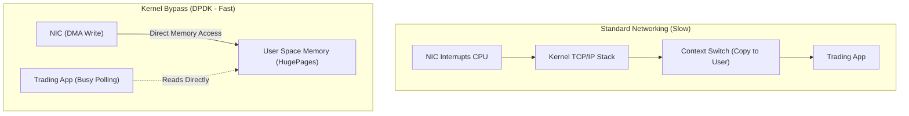

# Kernel Bypass & Ultra-Low Latency (DPDK)

## Core Mechanics

In High-Frequency Trading (HFT), a microsecond is an eternity. Traditional Linux networking is too slow because it relies on hardware interrupts and context switching between Kernel Space and User Space.

### 1. Kernel Bypass (DPDK)
Data Plane Development Kit (DPDK) allows an application to bypass the Linux kernel entirely.
- The NIC writes packet data directly into a memory buffer in User Space via DMA (Direct Memory Access).
- The OS networking stack, iptables, and socket buffers are completely skipped.

### 2. Polling vs Interrupts
Instead of waiting for an interrupt (IRQ) to signal a packet arrived (which costs expensive CPU context switches), the DPDK application dedicates a CPU core to spin in an infinite loop (Polling) checking for new packets. It burns 100% CPU to achieve near-zero latency.

### Kernel Bypass Flow Map

