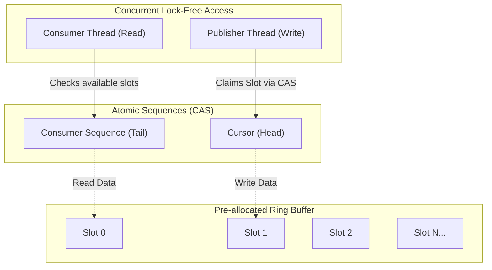

# Lock-Free Architecture & Ring Buffers

## Core Mechanics

Mutexes and Locks pause threads. In HFT systems, locking causes latency spikes (jitter). To process millions of orders per second, architectures must be Lock-Free.

### 1. The LMAX Disruptor
A revolutionary architecture for high-performance inter-thread communication.
- **Ring Buffer:** A pre-allocated, circular array. No garbage collection, no memory allocation during runtime.
- **Sequence Barriers:** Instead of locks, threads track atomic `Sequence` counters to know which slot in the array they are allowed to read or write.

### 2. Mechanical Sympathy (CPU Caches)
The Disruptor respects hardware. By padding data structures to 64 bytes (the size of a CPU Cache Line), it prevents "False Sharing"—a hardware phenomenon where two CPU cores accidentally invalidate each other's cache because they are modifying adjacent variables.

### Ring Buffer Architecture Map

