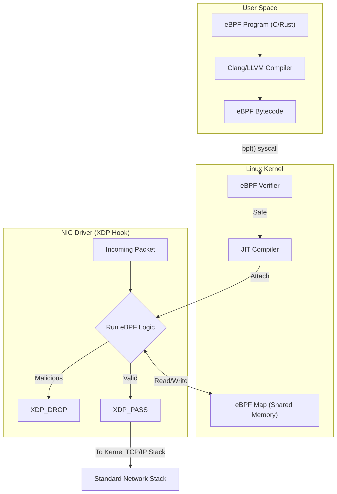

# eBPF & XDP Networking

## Core Mechanics

Extended Berkeley Packet Filter (eBPF) allows running sandboxed programs in a privileged context such as the Linux operating system kernel, without changing kernel source code or loading kernel modules.

### 1. eXpress Data Path (XDP)
XDP is a specific eBPF hook that attaches directly to the Network Interface Card (NIC) driver. It intercepts network packets *before* the Linux kernel's networking stack even sees them.
- Used for ultra-fast DDoS mitigation (Cloudflare), Load Balancing, and Firewalls.
- Can return `XDP_DROP` (discard immediately) or `XDP_PASS` (send to kernel).

### 2. The eBPF Verifier
To prevent a custom script from crashing the kernel, the eBPF Verifier analyzes the bytecode before loading. It ensures:
- No infinite loops.
- No out-of-bounds memory access.
- The program terminates safely.

### eBPF/XDP Architecture Map

