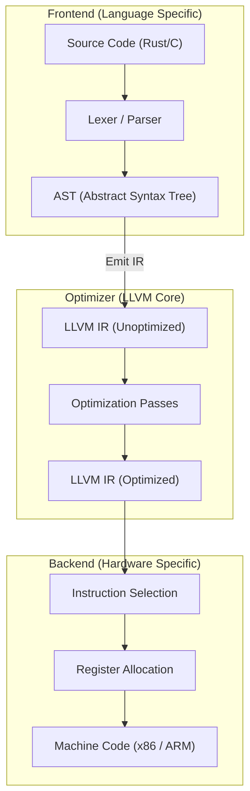

# LLVM Compiler Architecture

## Core Mechanics

LLVM is a collection of modular and reusable compiler and toolchain technologies. It is the backend for Rust, Swift, and modern C/C++ (Clang).

### 1. The Three-Phase Design
Unlike monolithic compilers, LLVM strictly separates concerns:
- **Frontend (e.g., Clang):** Parses source code (C++, Rust), builds an Abstract Syntax Tree (AST), and translates it into LLVM IR.
- **Optimizer:** Takes LLVM IR, applies language-independent optimizations (dead code elimination, loop unrolling), and outputs optimized IR.
- **Backend (Code Generator):** Translates optimized IR into target-specific machine code (x86, ARM, WebAssembly).

### 2. LLVM IR (Intermediate Representation)
A strongly typed, RISC-like virtual instruction set. It uses SSA (Static Single Assignment) form, meaning every variable is assigned exactly once, making data flow analysis for optimizations mathematically trivial.

### Compiler Flow Map

