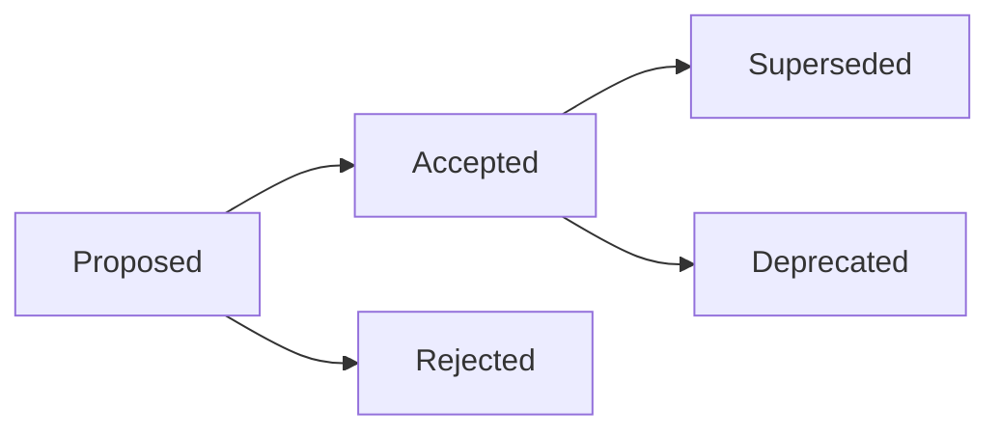

# ADR Best Practices

## Writing Effective ADRs

### When to Write an ADR

| Write an ADR | Don't Write an ADR |
|---|---|
| Choosing a database technology | Using tabs over spaces |
| API protocol decision (REST vs GraphQL) | Naming convention for branches |
| Authentication strategy | README formatting choice |
| Deployment model (container, serverless) | Single dependency version bump |
| Data model or schema approach | Bug fix approach |
| Framework or architecture pattern | Trivial library choice |
| Migration strategy | Personal preference (editor, tools) |

### Good ADR Characteristics

1. **Immutable** — Once accepted, an ADR never changes. If the decision
   changes, write a new ADR that supersedes the old one and update the
   old ADR's status to "Superseded by ADR-NNN."

2. **One decision per ADR** — If you find yourself documenting two
   choices, split them. Combination ADRs ("we chose PostgreSQL and
   Redis") make it impossible to supersede one part later.

3. **Alternatives are real options** — Listing "Do Nothing" without
   evaluating it, or comparing the chosen option against obviously
   inferior alternatives, produces a false decision. Every alternative
   must be plausibly chosen.

4. **Pros and cons are balanced** — If the chosen option has 5 pros
   and 1 con while alternatives have 1 pro and 5 cons, you are writing
   advocacy, not documentation.

5. **Compliance is specific** — "Code review" is not a compliance
   mechanism. "Architecture tests in CI that reject any new SQLAlchemy
   session creation outside the repository layer" is a compliance
   mechanism.

### Common ADR Anti-Patterns

1. **The Rubber Stamp ADR**
   ```
   ADR-042: Use React
   Status: Accepted
   Rationale: The team knows React.
   ```
   This fails to document context, alternatives, or consequences.
   In 2 years, no one knows why React was chosen over alternatives.

2. **The Novel ADR**
   ```
   ADR-043: Project Architecture
   Status: Accepted
   Context: [5000 words covering every architectural choice]
   ```
   A single ADR covering frontend framework, backend language,
   database, API protocol, and deployment model. Impossible to
   supersede individual decisions.

3. **The Sales Pitch ADR**
   ```
   Alternatives Considered:

   ### Vue.js
   **Pros:** None that matter.
   **Cons:** Vue is used by small companies, weak ecosystem,
   hard to hire for, no TypeScript support.
   **Why not chosen:** Inferior technology.
   ```
   Pros and cons are biased to steer the reader toward the preferred
   option. A real ADR treats all alternatives fairly.

4. **The Ghost ADR**
   ```
   Status: Accepted
   Decision: We will use microservices.
   Consequences: TBD.
   ```
   Includes no consequences, risks, or mitigations. The decision
   appears cost-free, which is never true.

### ADR Lifecycle



| Status | Meaning |
|--------|---------|
| Proposed | Decision is under review, not yet adopted |
| Accepted | Decision is approved and being implemented |
| Deprecated | Decision is no longer relevant (e.g., the feature was removed) |
| Superseded | A newer ADR replaces this decision |
| Rejected | The decision was considered but not adopted |

### Numbering Scheme

- Sequential: `ADR-001`, `ADR-002`, `ADR-003`
- No gaps, no re-use of numbers
- If an ADR is rejected, keep the number and mark status as Rejected
- This ensures every number maps to exactly one decision attempt

### Where to Store ADRs

```
docs/
  decisions/
    ADR-001-use-postgresql.md
    ADR-002-graphql-api.md
    ADR-003-manage-env-vars.md
    README.md  (table of contents with status)
```

The `README.md` in the decisions directory serves as an index:

```markdown
# Architecture Decisions

| ADR | Title | Status |
|-----|-------|--------|
| 001 | Use PostgreSQL as Primary Database | Accepted |
| 002 | Use GraphQL for Public API | Accepted |
| 003 | Environment Variable Management | Superseded by ADR-007 |
| 004 | Use Auth0 for Authentication | Accepted |
```

### Review Checklist

Before accepting an ADR, verify:

- [ ] Is this decision significant enough to document?
- [ ] Does the context describe the problem, not the solution?
- [ ] Are there at least 2 alternatives (including "do nothing")?
- [ ] Are all alternatives fairly evaluated?
- [ ] Is the rationale 2-3 sentences with specific reasoning?
- [ ] Are both positive and negative consequences documented?
- [ ] Is there a mitigation plan for each negative consequence?
- [ ] Is the compliance mechanism specific and enforceable?
- [ ] Does this overlap or conflict with any existing ADR?
- [ ] Can someone new to the project understand this in 5 minutes?

### Timing

Write ADRs at these moments:

- **Before implementation** — When choosing between multiple viable
  approaches
- **After a spike** — When a research spike reveals tradeoffs
- **During code review** — When a non-trivial pattern emerges that
  should be documented
- **Post-incident** — When an outage reveals an architectural
  weakness and the fix needs recording
