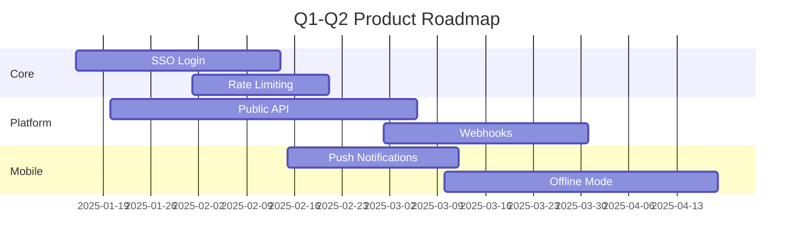

# Roadmap Tools

Tools and techniques for building, visualizing, and communicating
product roadmaps.

## Prioritization Frameworks

### RICE Scoring

```
RICE = (Reach × Impact × Confidence) / Effort
```

| Component | Description | Scale |
|-----------|-------------|-------|
| Reach | How many users/customers per quarter | Integer count |
| Impact | Magnitude of effect on key metric | 1 (low), 2 (medium), 3 (high) |
| Confidence | How sure are you about Reach and Impact? | 20%, 50%, 80%, 100% |
| Effort | Engineering person-days | Integer days |

**When to use:** Products with quantitative usage data and clear
metrics. Best for growth-stage products.

### MoSCoW Method

| Category | Meaning | % of Items |
|----------|---------|------------|
| Must have | Non-negotiable for launch or quarter goal | 20-30% |
| Should have | Important but can wait if needed | 30-40% |
| Could have | Nice to include if capacity allows | 20-30% |
| Won't have | Explicitly out of scope this period | 10-20% |

**When to use:** Time-constrained releases, fixed-date launches,
stakeholder alignment on scope.

### Kano Model

| Feature Type | User Satisfaction | Example |
|-------------|-------------------|---------|
| Basic (threshold) | Dissatisfied if absent, neutral if present | Login, search |
| Performance (linear) | More is better | Speed, storage |
| Excitement (delighter) | Neutral if absent, delighted if present | Dark mode, AI features |
| Indifferent | No impact | Backend admin features |
| Reverse | Some users want it, some don't | Social features in a pro tool |

**When to use:** Early-stage products trying to identify which
features will differentiate vs. which are table stakes.

### ICE Scoring

```
ICE = Impact × Confidence × Ease
```

Simpler than RICE but less precise. Impact (1-10), Confidence (1-10),
Ease (1-10). Multiply for score.

**When to use:** Quick prioritization in early-stage or ideation
sessions where effort estimates are unreliable.

## Visualization Tools

### Roadmap Software

| Tool | Best For | Price | Key Features |
|------|----------|-------|--------------|
| Productboard | Product teams with user feedback | $20/editor/mo | Score-based prioritization, feedback portal, theme mapping |
| Aha! | Enterprise product management | $59/mo | Strategy alignment, goal tracking, roadmap presentations |
| Notion | Small teams, flexible | Free-$10/mo | Databases, timelines, wiki-style docs |
| Linear | Engineering-focused teams | $8/user/mo | Issue tracking, roadmaps, cycle planning |
| Jira Product Discovery | Jira shops | Free-$10/user/mo | Score-based prioritization, Jira integration |
| Trello | Simple kanban-style | Free-$10/mo | Simple boards, power-ups, easy to share |
| Miro | Workshops and collaboration | $10/mo | Whiteboard, timeline templates, sticky notes |
| Airfocus | Prioritization-heavy workflows | $25/mo | Custom scoring models, portfolio view |

### Spreadsheet Template (Google Sheets / Excel)

For teams that need a lightweight solution:

```csv
Feature,Theme,RICE,MoSCoW,Q,Status,Notes
"SSO Login","Enterprise Readiness",9500,Must,Q1,In Progress,Blocked on security review
"Dark Mode","UX Polish",2400,Should,Q2,Not Started,Design complete
"Public API","Platform",18000,Must,Q1,Planned,Dependency on auth system
"Bulk Import","Data Management",4200,Could,Q3,Idea,Needs customer validation
```

### Mermaid Timeline (for README/docs)



## Communication Frameworks

### Stakeholder-Specific Views

| Audience | What They Care About | Format |
|----------|---------------------|--------|
| Executive team | Revenue impact, strategic alignment, big bets | Theme view with outcomes, 1-page summary |
| Engineering | What to build, dependencies, technical risks | Feature list with RICE, detailed timeline |
| Sales/Marketing | What they can promise, launch dates, competitive features | Feature view with dates and status |
| Customers | What's coming, when, why it matters | Public roadmap with themes and quarters |
| Board | Strategic direction, key milestones, resource needs | Annual roadmap with quarterly themes |

### Roadmap Communication Cadence

| Activity | Frequency | Audience | Format |
|----------|-----------|----------|--------|
| Roadmap review | Quarterly | All stakeholders | Presentation + document |
| Progress update | Monthly | Team + leadership | Dashboard + async update |
| Feature status | Weekly | Engineering + PM | Standup + tracker |
| External update | Quarterly | Customers + community | Blog post + public page |

## Anti-Patterns

| Anti-Pattern | Problem | Fix |
|---|---|---|
| Gantt chart feature overload | Too detailed, focuses on dates not outcomes | Use theme view, limit swimlanes |
| Everything is "P0" | No real prioritization, team is overwhelmed | Force MoSCoW: only 20% can be Must Have |
| Roadmap is a release plan | Ignores strategic direction, just lists features | Start with themes/outcomes, not feature names |
| Never updates | Becomes irrelevant within 2 months | Set monthly update cadence |
| Only PM touches it | No engineering input on effort estimates | Involve tech leads in RICE scoring |
| No "Won't Have" | Stakeholders assume everything is coming | Explicitly list deferred features |
| 18-month detailed plan | Guaranteed to be wrong beyond 2 quarters | Rolling wave: detail next quarter only |
