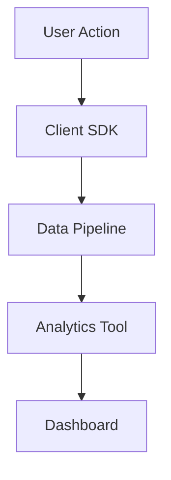

# Product Analytics

## Key Metrics
- **Retention Rate**: Percentage of users returning over time intervals (e.g., D1, D7, D30).
- **DAU/MAU Ratio**: Daily/Monthly Active Users for product stickiness.

## Event Tracking Workflow


## Template: Event Schema
```json
{
  "event_name": "Button Clicked",
  "properties": {
    "button_id": "signup_nav",
    "page": "home",
    "user_tier": "free"
  }
}
```
