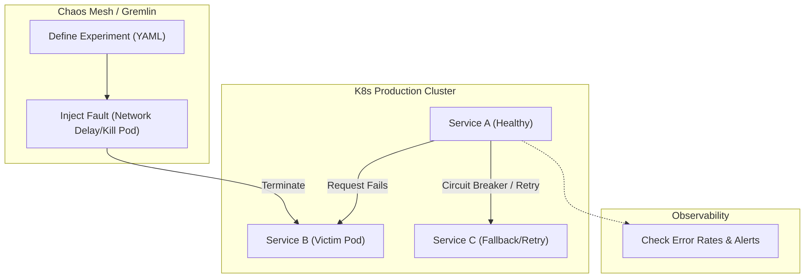

# Chaos Engineering & Fault Injection

## Core Architecture

Chaos Engineering is the discipline of experimenting on a software system in production to build confidence in its capability to withstand turbulent and unexpected conditions.

### 1. The Chaos Monkey
Pioneered by Netflix, Chaos Monkey randomly terminates EC2 instances or pods in production. The goal is to ensure that auto-scaling and fallback mechanisms actually work when infrastructure inevitably fails.

### 2. Blast Radius & Game Days
- **Blast Radius:** Always start small. Test on a single staging microservice before blowing up a production availability zone.
- **Game Days:** Scheduled events where engineers gather to manually trigger massive failures and practice incident response.

### Chaos Injection Map

