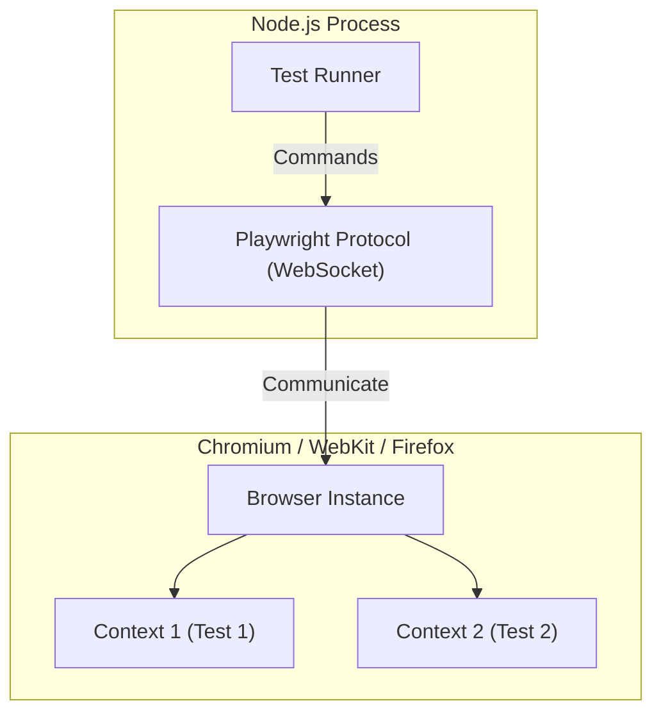

# E2E Testing with Playwright

## Core Architecture

Playwright is a modern End-to-End (E2E) testing framework that supersedes Selenium and Cypress, offering cross-browser automation with deep architecture integration.

### 1. Browser Contexts
Instead of launching a full browser for every test (which is slow), Playwright launches a single Browser instance. For each test, it creates an isolated **Browser Context** (like an incognito window). It takes milliseconds and ensures zero state leakage between tests.

### 2. Auto-Waiting & Tracing
Playwright automatically waits for elements to be actionable (visible, enabled, stable) before interacting with them, eliminating flaky tests caused by manual `sleep()` calls. It also captures full traces (DOM snapshots, network logs) on failure for easy debugging.

### Playwright Architecture Map

