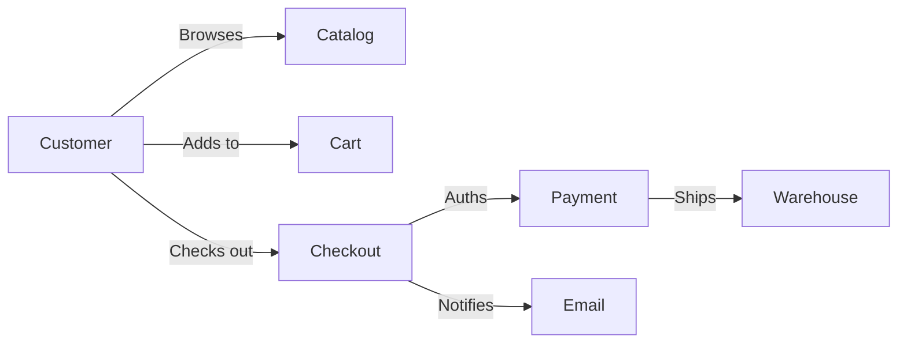

# Business Scenario Testing

## Overview

Business scenario testing validates end-to-end business processes from the user's perspective, covering complete workflows that span multiple systems, roles, and steps. Unlike unit or integration tests, business scenarios focus on business outcomes.

## Core Scenario Types

### 1. Happy Path (Sunny Day)

The ideal flow where everything works as expected.

**Example — Customer Purchase:**
```gherkin
Scenario: Customer successfully purchases a product
  Given a customer is logged in
  And they have items in their shopping cart
  When they proceed to checkout
  And they enter valid shipping details
  And they select "Credit Card" payment
  And they enter valid payment information
  And they confirm the order
  Then the order is placed successfully
  And the customer receives an order confirmation email
  And the inventory is decremented by the purchased quantity
  And a payment transaction is created with status "completed"
```

### 2. Alternate Flow

Valid but less common paths through the business process.

**Example — Guest Checkout:**
```gherkin
Scenario: Guest purchases with account creation after checkout
  Given a guest user has items in their cart
  When they proceed to checkout as a guest
  And they complete the purchase successfully
  Then the order is placed
  And they are offered to create an account
  When they create an account with email and password
  Then the order appears in their new account order history
```

### 3. Exception Flow

What happens when something goes wrong.

**Example — Payment Declined:**
```gherkin
Scenario: Payment is declined at checkout
  Given a customer is at the payment step of checkout
  When they enter a credit card that will be declined
  And they submit the payment
  Then they see a clear error message: "Your payment was declined"
  And the order remains in "payment_pending" state
  And the cart is not emptied
  And they can retry with a different payment method
  And the declined transaction is logged for fraud review
```

### 4. Regulatory Flow

Scenarios that must satisfy compliance or legal requirements.

**Example — GDPR Right to Erasure:**
```gherkin
Scenario: User requests account deletion with active subscriptions
  Given a user has an active premium subscription
  When they submit a data deletion request
  Then they receive confirmation of the request within 72 hours
  And active subscriptions are marked for cancellation
  And personal data is scheduled for erasure after legal retention period
  And a compliance audit log entry is created
```

### 5. Smoke Scenario

Lightweight business scenario used for deployment verification.

**Example — Buy One Thing:**
```gherkin
Scenario: Complete a single product purchase
  Given a new user account
  When they search for and select a product
  And they add it to cart and checkout
  And they complete payment
  Then the order confirmation page displays
  And the confirmation email is sent within 60 seconds
```

## Designing Business Scenarios

### Step 1: Map the Business Process

Identify actors, systems, and steps:



### Step 2: Identify Data Variations

| Scenario | Customer Type | Product | Payment | Shipping |
|----------|--------------|---------|---------|----------|
| Happy path | Returning | Physical | CC | Standard |
| Digital product | New | Digital | PayPal | N/A |
| Subscription | Returning | Service | CC | N/A |
| International | New | Physical | Wire | Express |
| Business account | Business | Physical | Invoice | Freight |

### Step 3: Define Acceptance Thresholds

| Scenario | Success Criteria |
|----------|-----------------|
| Happy path | Order created, email sent, inventory decremented |
| Payment declined | Clear error, cart preserved, retry possible |
| Fraud flag | Order held for review, customer notified |
| System timeout | Graceful error, cart preserved |

## End-to-End Business Flows

### SaaS Subscription Lifecycle

```gherkin
@e2e @subscription
Feature: Subscription Lifecycle

  Scenario: Free trial converts to paid subscription
    Given a new user signs up for a 14-day free trial
    When 13 days pass
    Then they receive a trial-expiring notification
    When they enter valid payment details
    Then their subscription converts to the paid plan
    And their trial end date extends to the billing date

  Scenario: Paid subscription auto-renewal
    Given a user has an active monthly subscription
    When the billing date arrives
    Then the payment is processed automatically
    And the subscription period is extended by one month
    And an invoice is emailed to the user

  Scenario: Subscription cancellation during trial
    Given a user is on a free trial
    When they cancel their subscription
    Then the trial continues until the original end date
    And no payment is collected
    And a confirmation email is sent
```

### Order to Cash Flow

```gherkin
@e2e @order-to-cash
Feature: Order to Cash

  Scenario: Complete order to fulfillment
    Given a customer places an order with standard shipping
    When the payment is authorized
    Then the order status is "confirmed"
    When the warehouse picks the items
    Then the order status updates to "picking_complete"
    When the items are shipped
    Then the customer receives a shipping notification
    And the tracking number is available in their account
    When the order is delivered
    Then the order status is "completed"
    And the revenue is recognized in the accounting system
```

## Scenario Coverage Matrix

| Business Flow | Happy | Alternate | Exception | Regulatory | Automated |
|---------------|-------|-----------|-----------|------------|-----------|
| User Registration | ✓ | ✓ | ✓ | ✓ GDPR | ✓ |
| Product Search | ✓ | ✓ | ✓ | — | ✓ |
| Add to Cart | ✓ | ✓ | ✓ | — | ✓ |
| Checkout | ✓ | ✓ | ✓ | — | ✓ |
| Payment | ✓ | ✓ | ✓ | PCI | ✓ |
| Order Fulfillment | ✓ | ✓ | ✓ | — | Partial |
| Returns | ✓ | ✓ | ✓ | — | Manual |
| Subscription | ✓ | ✓ | ✓ | ✓ CTA | ✓ |

## Best Practices

1. **One scenario per business outcome**: Don't test multiple outcomes in one scenario
2. **Use domain language**: Business terminology, not technical jargon
3. **Include data setup**: Explicitly state what data is needed for the scenario
4. **Test across systems**: Business scenarios cross system boundaries by design
5. **Prioritize by business value**: Critical revenue flows first, then compliance, then operational
6. **Review with stakeholders**: Business analysts and product owners validate scenario accuracy
7. **Maintain alongside requirements**: Update scenarios when business rules change

## Common Mistakes

- Testing only happy paths (no exception flows)
- Writing technical scenarios instead of business scenarios
- Scenarios too long (more than 10 steps is too long)
- Ignoring timing dependencies (batch jobs, daily cutoffs)
- Testing each system in isolation (misses integration failures)
- Not cleaning up test data between scenarios
