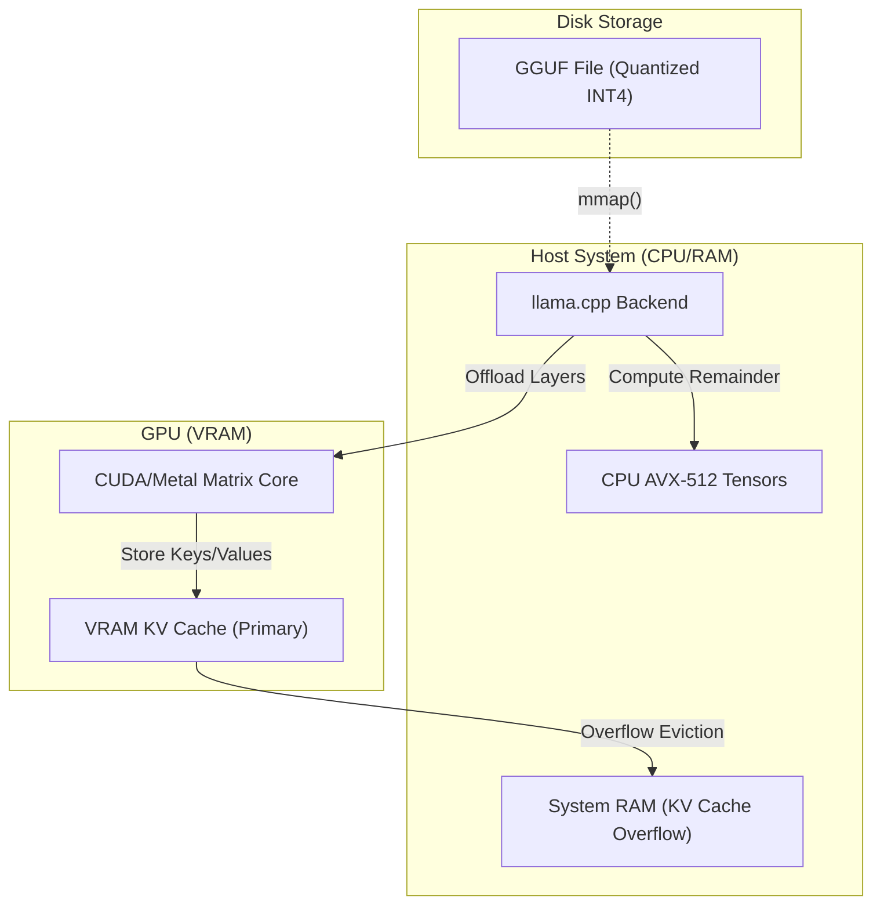

# Local SLM Inference & KV Cache Offloading

## PoC Architecture Design

This PoC details the mechanics of running Small Language Models (SLMs) locally using `llama.cpp` and `Ollama`, focusing on memory management and GGUF parsing.

### Core Mechanics
1. **GGUF Format:** The GGUF (GPT-Generated Unified Format) standard packs the tokenizer, model hyper-parameters, and quantized tensors into a single file. Reading GGUF requires memory-mapping (mmap) the tensors to avoid loading the entire model into RAM.
2. **KV Cache Offloading:** During decoding, the Key-Value (KV) cache grows linearly with sequence length. `llama.cpp` allows splitting the KV cache between VRAM (GPU) and RAM (CPU). 
3. **Tensor Splitting (Row/Column):** For multi-GPU or hybrid CPU/GPU setups, computations are batched, and matrix multiplications are offloaded to CUDA APIs while remaining layers run on AVX2 CPU instructions.

### Architecture Map

