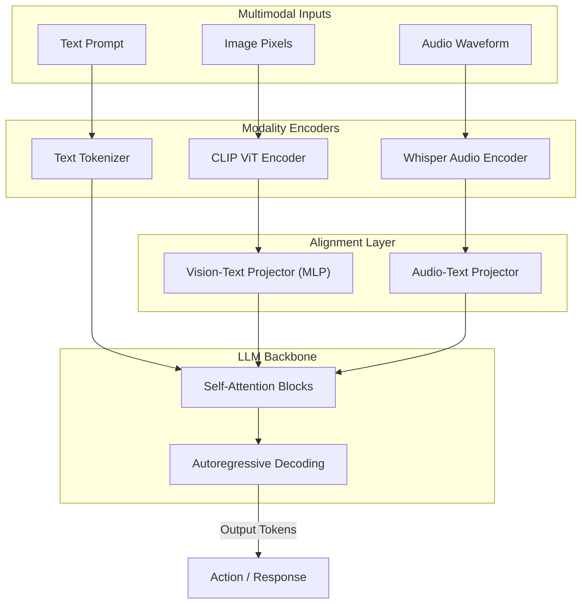

# Multimodal AI Pipelines (Vision & Audio)

## PoC Architecture Design

This PoC explores the bridging mechanisms required to feed images (Vision) and Audio directly into an LLM, bypassing traditional OCR or Speech-to-Text APIs for a true Multimodal embedding space.

### Core Mechanics
1. **Vision-Language Bridging:** Models like LLaVA or Qwen-VL use a Vision Encoder (e.g., CLIP ViT) to process an image into patch embeddings. These patches are passed through a projection layer (MLP) to align visual tokens with the text embedding space.
2. **Audio-Text Pipelines:** Audio streams are segmented and processed via Whisper (or native audio encoders) into spectogram embeddings. 
3. **Cross-Attention:** The LLM's transformer blocks use cross-attention to attend to both the text tokens and the visual/audio tokens simultaneously during autoregressive generation.

### Architecture Map

