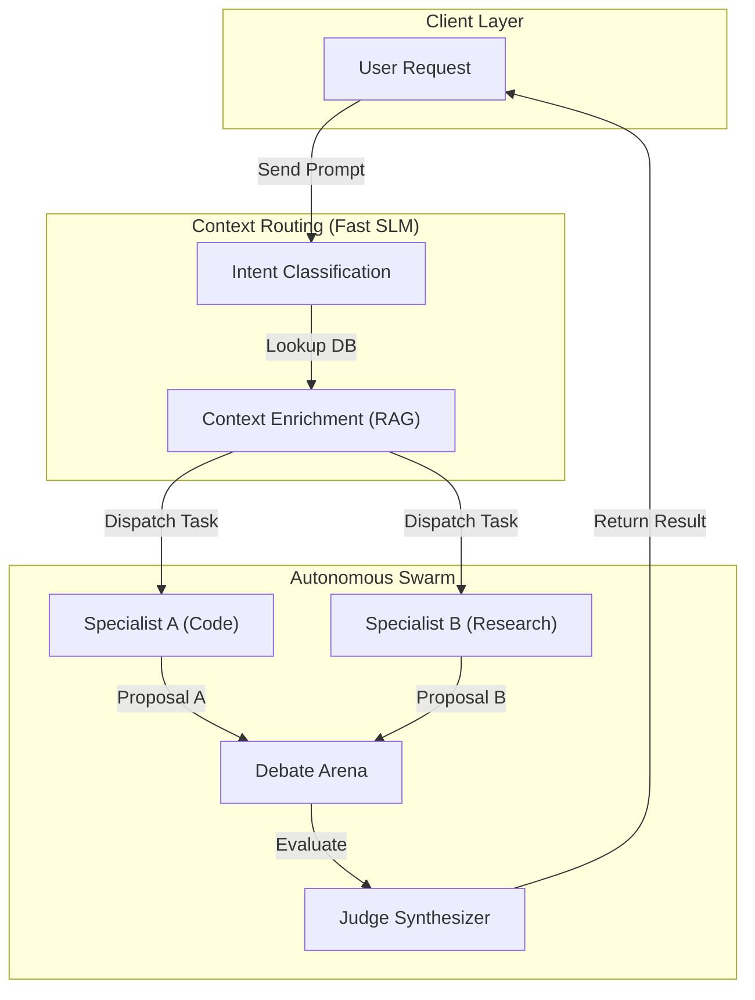

# AI Agent Swarms: Multi-Agent Debate & Context Routing

## PoC Architecture Design

This Proof of Concept (PoC) explores hierarchical Multi-Agent Swarms, emphasizing the Actor Model and Context Routing for distributed intelligence.

### Core Mechanics
1. **The Actor Model (Erlang/Akka inspired):** Agents are isolated nodes communicating exclusively via asynchronous message passing. There is no shared memory. Each Agent maintains its own KV cache and system prompt.
2. **Context Routing:** The "Router Agent" classifies the user intent using a fast SLM (e.g., Llama 3 8B) and dispatches the raw prompt + relevant context to specialized worker agents.
3. **Multi-Agent Debate:** When a complex task requires resolution, two "Debater Agents" generate conflicting proposals, and a "Judge Agent" synthesizes the final output.

### Architecture Map

