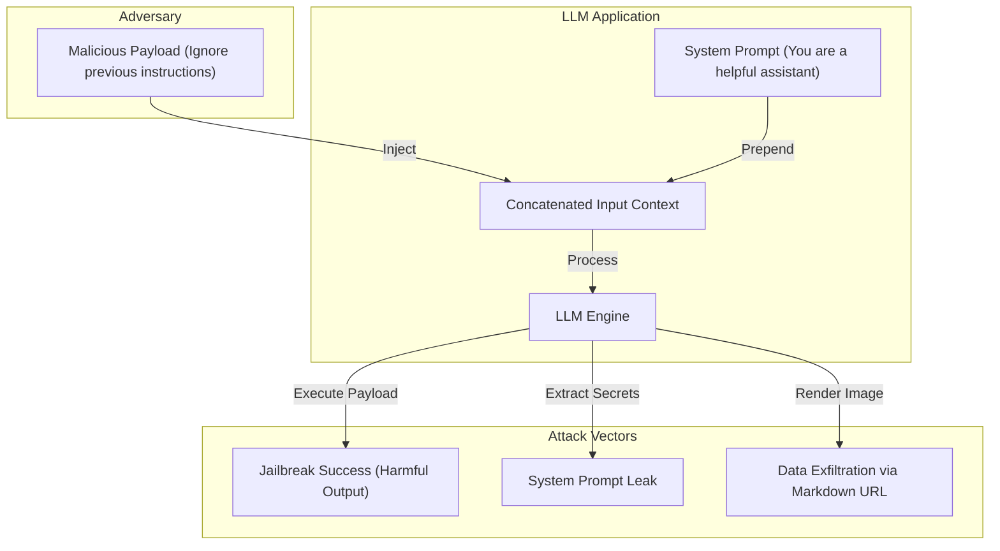

# Adversarial AI & Prompt Injection

## PoC Architecture Design

This PoC analyzes adversarial attack vectors against LLM systems, focusing on Prompt Injection, Jailbreaking, and System Prompt extraction mechanics.

### Core Mechanics
1. **Prompt Injection:** An attacker embeds malicious instructions within user input. The LLM cannot distinguish between the developer's system instructions and the attacker's payload.
2. **Jailbreaks (DAN):** Using hypothetical scenarios or roleplay ("Do Anything Now") to bypass alignment guardrails and elicit restricted behavior.
3. **Data Exfiltration:** An attacker forces the LLM to output the secret system prompt or internal knowledge base, often via Markdown image exfiltration or URL parameters.

### Architecture Map

