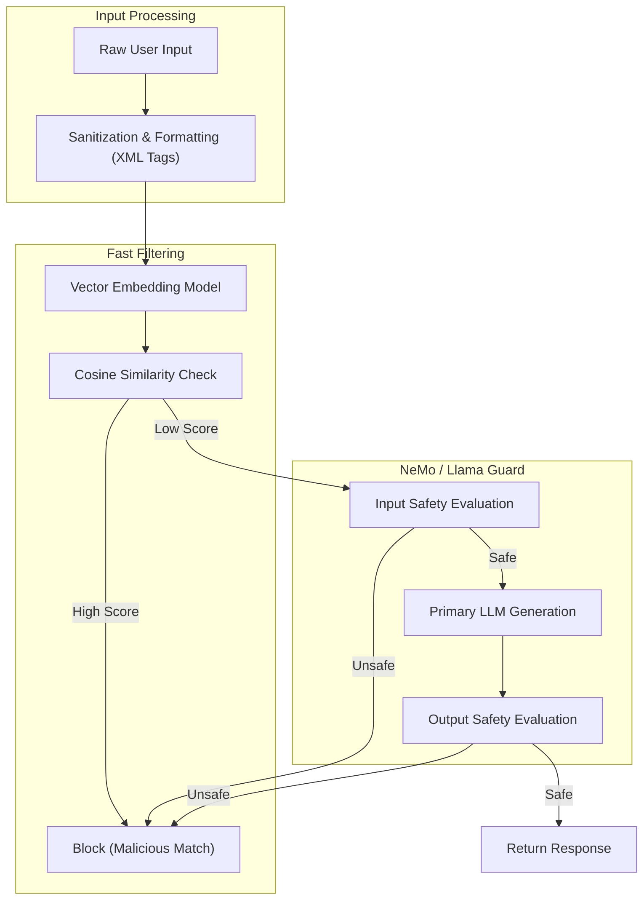

# AI Defense Mechanisms & Guardrails

## PoC Architecture Design

This PoC details the implementation of robust defense architectures for LLM systems, leveraging Semantic Routers and Guardrails to mitigate adversarial attacks.

### Core Mechanics
1. **Semantic Routing:** A fast vector search matches incoming prompts against a database of known malicious intents or topics. If a match is found, the request is blocked before reaching the main LLM.
2. **Input/Output Guardrails (NeMo):** A dedicated secondary LLM (e.g., Llama Guard) evaluates the safety of the user input and the generated output, enforcing strict conversational bounds.
3. **Sanitization:** Stripping control characters, limiting context length, and using delimiters (like XML tags `<user_input>`) to segregate instructions from data.

### Architecture Map

