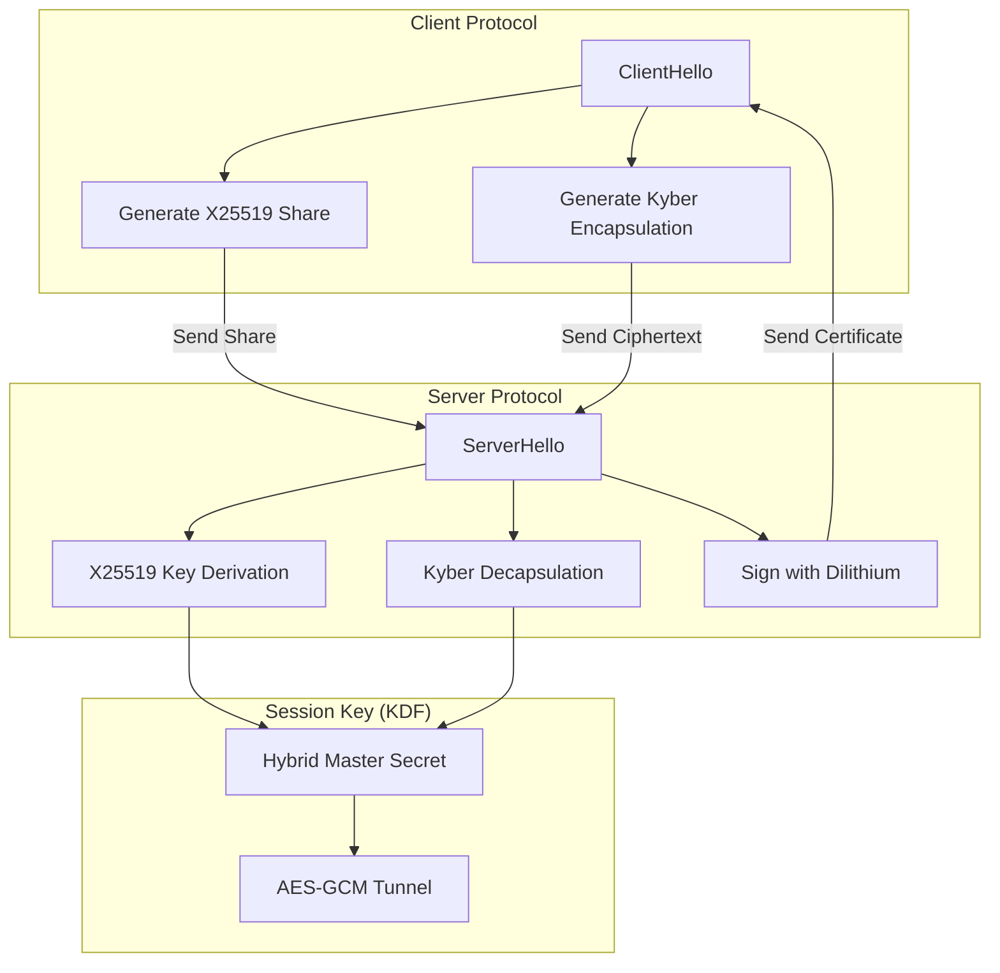

# Post-Quantum Cryptography (PQC) Integration

## PoC Architecture Design

This PoC outlines the integration of Post-Quantum Cryptographic algorithms (such as Kyber and Dilithium) into modern TLS tunnels to resist future "Harvest Now, Decrypt Later" attacks by quantum computers.

### Core Mechanics
1. **Lattice-Based Cryptography:** Algorithms like CRYSTALS-Kyber rely on the hardness of the Learning With Errors (LWE) problem, which is believed to be resistant to Shor's Algorithm.
2. **Hybrid Key Exchange (KEM):** Modern TLS 1.3 handshakes combine traditional Elliptic Curve Diffie-Hellman (X25519) with a PQC KEM (Kyber) to derive the session key. If the PQC algorithm is broken, the ECC security remains.
3. **Post-Quantum Signatures:** Using CRYSTALS-Dilithium for certificate signing and authentication, replacing RSA or ECDSA.

### Architecture Map

