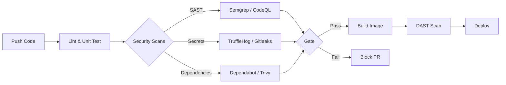

# DevSecOps: Automated Security Scanning

Embed security directly into CI/CD pipelines to catch vulnerabilities early. Focus on Static Application Security Testing (SAST), Dynamic Application Security Testing (DAST), and Secret Scanning.

## Pipeline Architecture



## GitHub Actions Example (SAST & Secrets)

```yaml
name: DevSecOps Pipeline
on: [push, pull_request]

jobs:
  security-scans:
    runs-on: ubuntu-latest
    steps:
      - name: Checkout Code
        uses: actions/checkout@v4

      - name: Secret Scanning (TruffleHog)
        uses: trufflesecurity/trufflehog@main
        with:
          path: ./
          base: ${{ github.event.repository.default_branch }}
          head: HEAD
          extra_args: --only-verified

      - name: SAST Scanning (Semgrep)
        uses: returntocorp/semgrep-action@v1
        with:
          config: "p/default"
```
