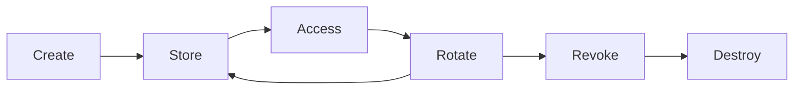

# Secrets Management Fundamentals

## Overview
Secrets management is the practice of securely storing, accessing, rotating, and auditing sensitive credentials such as API keys, database passwords, certificates, SSH keys, and tokens. Proper secrets management prevents unauthorized access, data breaches, and credential-based attacks. It's a foundational security control in any production environment.

## Core Concepts

### Concept 1: Secrets Categories
- **Static secrets**: Permanent credentials (database passwords, API keys, certificates)
- **Dynamic secrets**: Generated on-demand with short lifetimes (temporary database credentials, STS tokens)
- **Service-to-service auth**: mTLS, JWT, SPIFFE (workload identity)
- **Configuration secrets**: Environment variables, config file contents containing sensitive data

### Concept 2: Secrets Lifecycle


### Concept 3: Secret Storage Approaches
| Approach | Examples | Security | Complexity |
|----------|----------|----------|------------|
| Vault/Cloud KMS | HashiCorp Vault, AWS Secrets Manager, GCP Secret Manager | High | Medium |
| Environment variables | OS env, Docker env_file | Low | Low |
| Encrypted files | SOPS, BlackBox, sealed secrets | Medium | Low |
| CI/CD secrets | GitHub Secrets, GitLab CI variables | Medium | Low |
| Hardcoded | String literals in code | None | None |

### Concept 4: Principle of Least Privilege for Secrets
- Applications should only access the secrets they need
- Secrets scoped to environment (dev vs prod)
- Human access to secrets requires break-glass procedures
- Dynamic secrets with auto-rotation reduce blast radius

## Implementation Guide

### Step 1: Choose a Secrets Manager
```yaml
# HashiCorp Vault configuration
vault:
  backend:
    type: raft  # Integrated storage
  seal:
    type: shamir  # or auto-unseal with AWS KMS, Azure Key Vault
  auth_methods:
    - kubernetes:  # For containerized workloads
        mount: /auth/kubernetes
    - approle:    # For non-Kubernetes workloads
        mount: /auth/approle
    - token:      # For human operators
        mount: /auth/token

  # Database dynamic credentials
  database_mount: /database
  database_configs:
    - name: postgres-prod
      plugin: postgresql-database-plugin
      allowed_roles:
        - read-only
        - read-write

  # Dynamic role
  database_roles:
    - name: read-write
      db_name: postgres-prod
      creation_statements:
        - "CREATE USER \"{{name}}\" WITH PASSWORD '{{password}}' VALID UNTIL '{{expiration}}';"
        - "GRANT SELECT, INSERT, UPDATE, DELETE ON ALL TABLES IN SCHEMA public TO \"{{name}}\";"
      default_ttl: 1h
      max_ttl: 24h
```

### Step 2: Application Secret Retrieval
```python
# Production secret retrieval from Vault
import hvac
import os
from typing import Optional

class VaultSecretManager:
    """Retrieve secrets from HashiCorp Vault."""

    def __init__(self):
        self.client = hvac.Client(
            url=os.environ["VAULT_ADDR"],
            token=self._authenticate(),
        )

    def _authenticate(self) -> str:
        """Authenticate to Vault using Kubernetes service account token."""
        if os.path.exists("/var/run/secrets/kubernetes.io/serviceaccount/token"):
            with open("/var/run/secrets/kubernetes.io/serviceaccount/token") as f:
                jwt = f.read()
            response = self.client.auth.kubernetes.login(
                role="my-app",
                jwt=jwt,
            )
            return response["auth"]["client_token"]
        # Fallback to AppRole for non-K8s environments
        role_id = os.environ["VAULT_ROLE_ID"]
        secret_id = os.environ["VAULT_SECRET_ID"]
        response = self.client.auth.approle.login(role_id=role_id, secret_id=secret_id)
        return response["auth"]["client_token"]

    def get_database_credentials(self, role: str = "read-write") -> dict:
        """Get dynamic database credentials."""
        response = self.client.secrets.database.generate_credentials(
            name=role,
            mount_point="database",
        )
        return {
            "username": response["data"]["username"],
            "password": response["data"]["password"],
        }

    def get_secret(self, path: str, key: str) -> Optional[str]:
        """Get a static secret from Vault KV store."""
        response = self.client.secrets.kv.v2.read_secret_version(
            path=path,
            mount_point="secret",
        )
        return response["data"]["data"].get(key)
```

### Step 3: Secret Leak Prevention (pre-commit)
```yaml
# .pre-commit-config.yaml secrets detection
repos:
  - repo: https://github.com/gitleaks/gitleaks
    rev: v8.18.0
    hooks:
      - id: gitleaks
        args: ["--verbose"]

  - repo: https://github.com/pyupio/safety
    rev: v3.0.0
    hooks:
      - id: safety
        args: ["check", "--full-report"]
```

### Step 4: GitLeaks Custom Rules
```toml
# .gitleaks.toml
title = "Custom Secret Detection Rules"

[[rules]]
id = "my-api-key"
description = "My API key pattern"
regex = '''(?i)my_api_key[_\-]?=?\s*['"][A-Za-z0-9_\-]{40}['"]'''
tags = ["api", "custom"]

[[rules]]
id = "private-key"
description = "Private key"
regex = '''-----BEGIN (RSA|EC|OPENSSH|DSA) PRIVATE KEY-----'''
tags = ["key", "ssh"]
```

## Best Practices
- Never hardcode secrets in source code, config files, or documentation
- Use a dedicated secrets manager — not environment variables for production secrets
- Implement least privilege: applications access only their needed secrets
- Rotate secrets regularly — every 90 days for static secrets, dynamic on each use
- Audit all secret access — who accessed what secret and when
- Use short-lived dynamic secrets when possible
- Implement break-glass emergency access for human secret access
- Scan code repositories for accidentally committed secrets
- Use pre-commit hooks to prevent secret commits
- Encrypt secrets at rest and in transit

## Common Pitfalls
- Hardcoding credentials in source code (most common and dangerous)
- Checking secrets into version control (especially public repos)
- Sharing secrets via insecure channels (email, chat, post-it notes)
- Using long-lived static secrets when dynamic secrets are possible
- Over-permissive secret access (any app can access any secret)
- No secret rotation — compromised secrets remain valid forever
- Not rotating after employee departure
- Using the same secret across environments (dev secret = prod secret)
- Secrets in environment variables — exposed in process lists, logs, error messages
- Not encrypting secrets at rest (plaintext secrets in database or config files)
- Logging or exposing secrets in error messages

## Key Points
- Secrets management securely stores, accesses, rotates, and audits credentials
- Static secrets are long-lived; dynamic secrets are on-demand with auto-expiration
- Use dedicated secrets manager (Vault, AWS Secrets Manager, Azure Key Vault, GCP Secret Manager)
- Never hardcode secrets in code or config files
- Implement least privilege for secret access
- Rotate secrets regularly — dynamic secrets are preferred
- Audit all secret access for compliance
- Use pre-commit hooks to prevent secret commits
- Scan for leaked secrets in repositories regularly
- Encrypt secrets at rest and in transit
- Protect secrets in memory and avoid logging them
