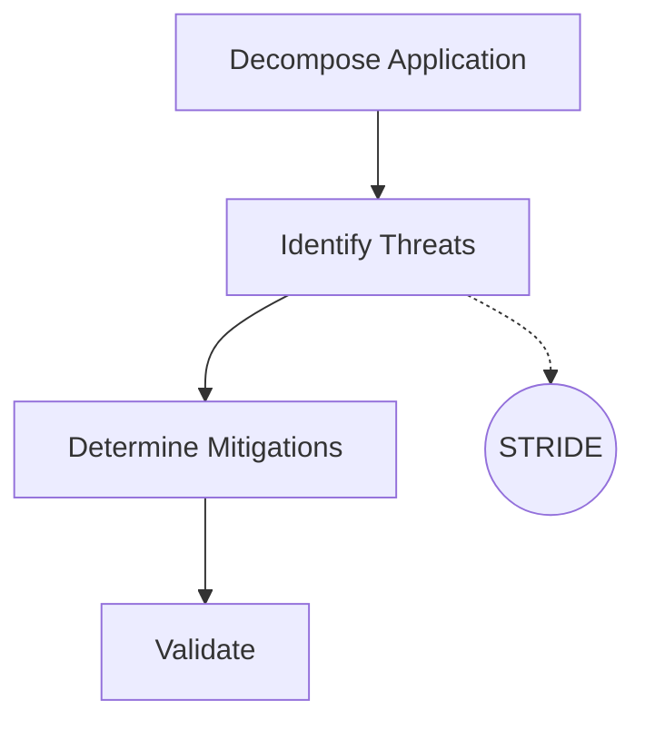

# Threat Modeling (STRIDE)

Identify and mitigate architectural security flaws during the design phase, before any code is written.

## Methodology: STRIDE

*   **S**poofing: Impersonating something or someone else. (Mitigation: Strong Authentication)
*   **T**ampering: Modifying data or code. (Mitigation: Integrity checks, TLS)
*   **R**epudiation: Claiming to have not performed an action. (Mitigation: Secure Logging, Auditing)
*   **I**nformation Disclosure: Exposing information to unauthorized users. (Mitigation: Encryption at rest/transit)
*   **D**enial of Service: Denying or degrading service to users. (Mitigation: Rate limiting, WAF)
*   **E**levation of Privilege: Gaining capabilities without proper authorization. (Mitigation: RBAC, Least Privilege)

## Threat Modeling Process

## Security-by-Design Checklist

- [ ] Data flow diagrams (DFDs) created for all trust boundaries.
- [ ] Authentication and Authorization defined at every entry point.
- [ ] Secrets management strategy established (no hardcoded credentials).
- [ ] Input validation and output encoding strictly enforced.
