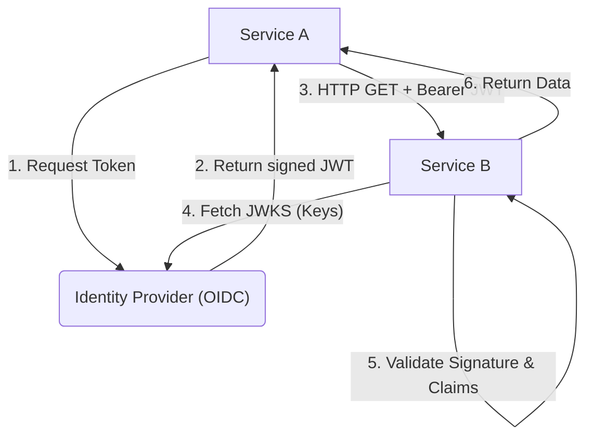

# Zero Trust: JWT Authentication Flows

## 1. JSON Web Tokens in ZTA
In Zero Trust, every request between microservices must be independently authenticated and authorized. JWTs (JSON Web Tokens) are the standard for stateless assertion of identity and claims.

### The Anatomy of a JWT
A JWT consists of `Header.Payload.Signature`.
- **Header**: Contains the algorithm (e.g., `RS256`) and the Key ID (`kid`) used to sign it.
- **Payload**: Contains claims (e.g., `sub` for subject, `exp` for expiration, `aud` for audience, and custom RBAC scopes).
- **Signature**: Ensures the payload hasn't been tampered with.

## 2. Service-to-Service Flow

## 3. Critical Validation Rules
To prevent catastrophic Zero Trust failures, receiving services MUST validate:
1. **Signature**: Cryptographically verify using the IdP's public key (fetched via the JWKS endpoint).
2. **`exp` (Expiration)**: Reject if the current time is past the timestamp.
3. **`aud` (Audience)**: Reject if the token was not explicitly intended for this service (prevents token reuse/replay attacks across different services).
4. **`iss` (Issuer)**: Ensure the token came from the trusted organizational IdP.
