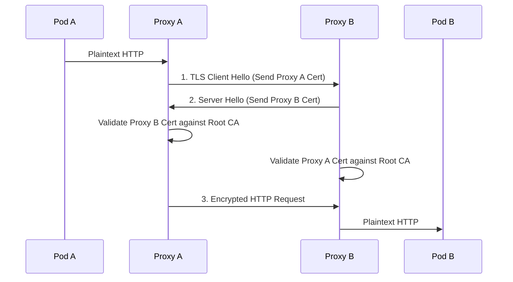

# Zero Trust: Mutual TLS (mTLS)

## 1. Core Concepts
Standard TLS (HTTPS) only authenticates the server to the client. The client knows it is talking to the real bank, but the bank doesn't know who the client is until a password or token is provided.

**Mutual TLS (mTLS)** requires both parties to present an X.509 certificate. The server verifies the client's certificate against a trusted Certificate Authority (CA), and the client verifies the server's certificate.

## 2. mTLS in the Service Mesh
In a microservices environment, configuring mTLS manually in every application (Java, Node, Go) is an anti-pattern. ZTA pushes this to the infrastructure layer via a Service Mesh (e.g., Istio, Linkerd).



## 3. Strict vs Permissive Mode
When migrating to Zero Trust, turning on mTLS instantly will break applications that haven't been onboarded.
- **Permissive Mode**: The server accepts both plaintext and mTLS traffic. Used for transitioning.
- **Strict Mode**: The server rejects all plaintext traffic. This is the final Zero Trust state.

### Istio Strict Policy Example
```yaml
apiVersion: security.istio.io/v1beta1
kind: PeerAuthentication
metadata:
  name: default-mtls
  namespace: istio-system
spec:
  mtls:
    mode: STRICT
```
