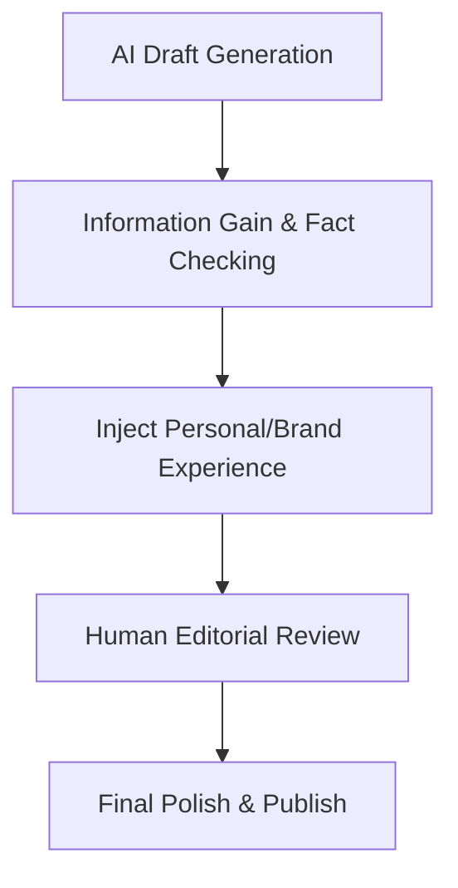

# AI Content Optimization

Ensuring AI-generated content meets EEAT (Experience, Expertise, Authoritativeness, Trustworthiness) guidelines to rank well and avoid algorithmic penalties.

## Optimization Pipeline



## Strategy & Implementation

1. **Information Gain**: Add unique data, original research, or proprietary insights not found in the LLM's training data.
2. **Formatting & Readability**: Break up text, use lists, bold important concepts, and keep paragraphs short.
3. **Human-in-the-Loop**: Never publish raw output. Have an editor review for tone, accuracy, and flow.

### Example System Prompt for Initial Draft

```text
You are an expert SEO content writer. Write a comprehensive guide on {Topic}. 
Requirements:
1. Target keyword: {PrimaryKeyword} (use naturally).
2. Structure with clear H2 and H3 headings.
3. Include real-world examples and avoid generic fluff.
4. Output in Markdown format.
```
