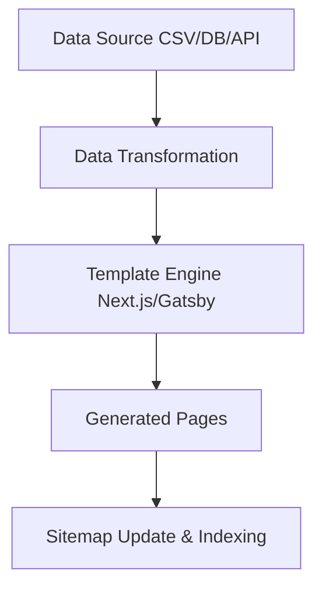

# Programmatic SEO

Focuses on generating pages from structured data sets using templates to target long-tail keywords efficiently.

## Architecture



## Example Implementation (Next.js)

```javascript
// pages/[category]/[location].js
import { fetchLocationData } from '../../lib/api';

export async function getStaticPaths() {
  const locations = await fetchLocationData();
  const paths = locations.map(loc => ({
    params: { category: loc.categorySlug, location: loc.locationSlug }
  }));
  return { paths, fallback: 'blocking' };
}

export async function getStaticProps({ params }) {
  const data = await getPageData(params.category, params.location);
  if (!data) return { notFound: true };
  
  return {
    props: { data },
    revalidate: 86400, // ISR: revalidate daily
  };
}

export default function ProgrammaticPage({ data }) {
  return (
    <article>
      <h1>Best {data.categoryName} in {data.locationName}</h1>
      <p>{data.description}</p>
    </article>
  );
}
```
