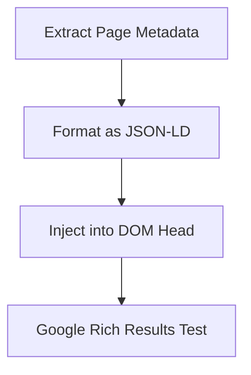

# Structured Data

Injecting JSON-LD provides explicit clues about the meaning of a page to search engines, enabling rich results in SERP.

## Workflow



## Example Implementation (React Helmet)

```javascript
import { Helmet } from 'react-helmet';

export function ProductSchema({ product }) {
  const schema = {
    "@context": "https://schema.org/",
    "@type": "Product",
    "name": product.title,
    "image": product.images,
    "description": product.description,
    "sku": product.sku,
    "offers": {
      "@type": "Offer",
      "url": product.url,
      "priceCurrency": "USD",
      "price": product.price,
      "itemCondition": "https://schema.org/NewCondition",
      "availability": "https://schema.org/InStock"
    }
  };

  return (
    <Helmet>
      <script type="application/ld+json">
        {JSON.stringify(schema)}
      </script>
    </Helmet>
  );
}
```
