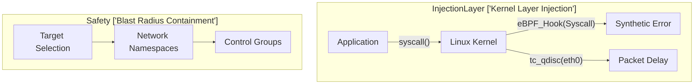

# Chaos Engineering: Under the Hood

Chaos engineering involves deliberate fault injection to validate system resilience.

## Kernel-Layer Fault Injection
Tools like eBPF (Extended Berkeley Packet Filter) and Linux `tc` (Traffic Control) allow precise, low-overhead fault injection directly into the kernel network stack.
- **eBPF System Call Hooking**: Overriding `connect()`, `read()`, or `write()` syscalls to return synthetic `EAGAIN` or `ETIMEDOUT` errors.
- **Traffic Shaping**: Using `tc-netem` (Network Emulator) for packet corruption, delay, or dropping.

## Blast Radius Containment
- **cgroups and Namespaces**: Restricting chaos agents to specific container namespaces ensures isolation.
- **Abort Conditions**: Real-time evaluation of Golden Signals (Latency, Traffic, Errors, Saturation). If SLIs breach the containment threshold, all eBPF hooks and `tc` rules are instantly flushed.
