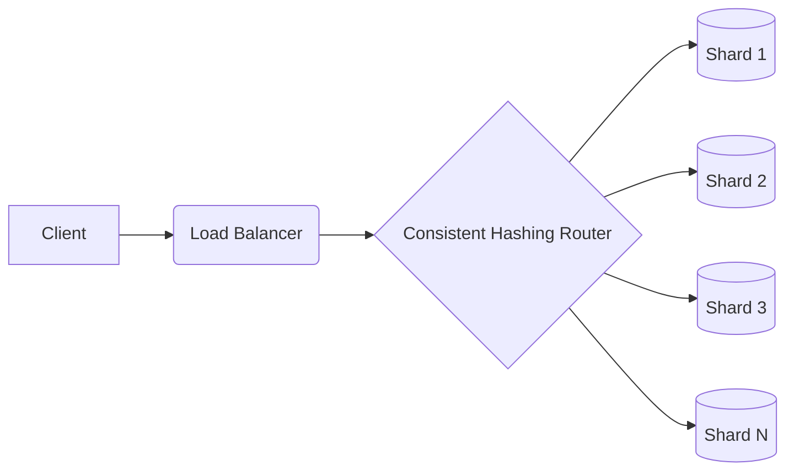

# Database Sharding

## Key Concepts
- **Consistent Hashing**: Distributes data across a cluster such that adding or removing a node only affects $K/N$ keys.
- **Horizontal Scaling**: Adding more machines to a database cluster to handle increased load.

## Consistent Hashing Pseudocode
```python
import hashlib
import bisect

class ConsistentHash:
    def __init__(self, nodes, replicas=3):
        self.replicas = replicas
        self.ring = dict()
        self.sorted_keys = []
        for node in nodes:
            self.add_node(node)

    def _hash(self, key):
        return int(hashlib.md5(key.encode('utf-8')).hexdigest(), 16)

    def add_node(self, node):
        for i in range(self.replicas):
            key = self._hash(f"{node}:{i}")
            self.ring[key] = node
            bisect.insort(self.sorted_keys, key)

    def get_node(self, key):
        if not self.ring: return None
        h = self._hash(key)
        idx = bisect.bisect(self.sorted_keys, h)
        if idx == len(self.sorted_keys): idx = 0
        return self.ring[self.sorted_keys[idx]]
```

## Architecture

