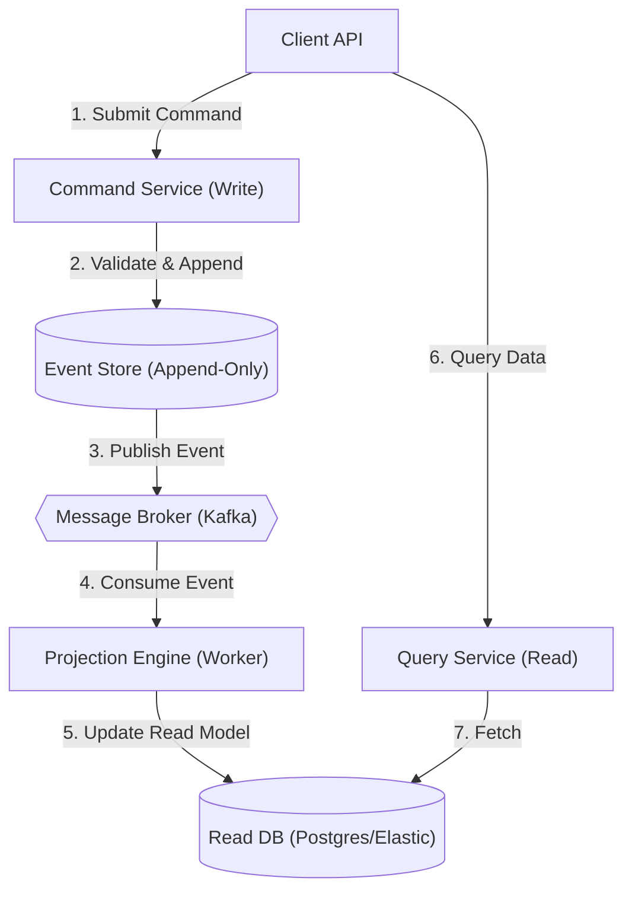

# CQRS and Event Sourcing Architecture

## 1. The Core Problem
In an Event Sourced system, the state of an application is not stored as a current snapshot (e.g., `User { status: 'active', balance: 50 }`), but rather as a sequence of immutable events (`UserCreated`, `FundsDeposited`, `AccountActivated`). 

While writing (appending) to an Event Store is incredibly fast ($O(1)$ complexity), reading from it to answer complex queries (e.g., "Give me all active users with a balance over 100") is impossible without replaying every single event in the system.

## 2. Command Query Responsibility Segregation (CQRS)
To solve the read problem, we must physically separate the Write Model (Commands) from the Read Model (Queries).

### The Write Side (Command)
- Accepts commands (e.g., `DepositFundsCommand`).
- Validates business logic.
- Appends the resulting event (`FundsDepositedEvent`) to the Event Store.
- Highly optimized for consistency and write throughput.

### The Read Side (Query / Projections)
- Listens to events published by the Event Store (usually via a message broker like Apache Kafka).
- Updates highly denormalized database tables (e.g., Elasticsearch for search, PostgreSQL for relational queries, Redis for key-value lookups).
- Highly optimized for read throughput (queries require zero joins).

## 3. Architectural Flow

## 4. Trade-offs: Eventual Consistency
Because the Read Model is updated asynchronously by a background worker (the Projection), there is a replication lag (typically milliseconds). 
- **The Issue**: A user submits a command, receives a `200 OK`, refreshes the page, and the data hasn't updated yet.
- **The Solution**: 
  1. The Command API returns the `EventID` or `Version` of the aggregate.
  2. The Client passes this `Version` when querying the Read API.
  3. The Read API blocks or polls until the Read Database's version matches or exceeds the requested version.
