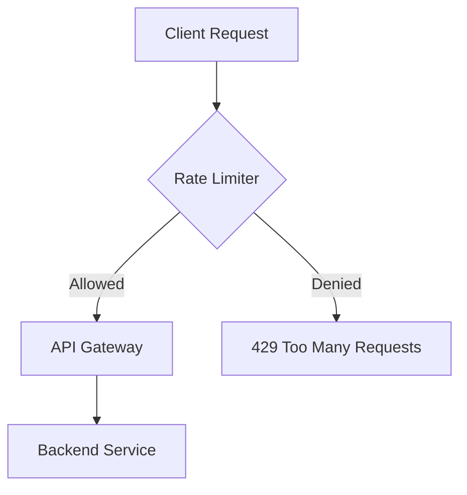

# Rate Limiting

## Algorithms

### 1. Token Bucket
Tokens are added to a bucket at a fixed rate. Each request consumes a token. If the bucket is empty, the request is dropped.

### 2. Leaky Bucket
Requests are added to a queue (bucket). The queue is processed at a fixed rate. If the queue is full, new requests are dropped.

## Redis Lua Script (Token Bucket)
```lua
-- KEYS[1]: rate limit key
-- ARGV[1]: capacity (max tokens)
-- ARGV[2]: rate (tokens per second)
-- ARGV[3]: current timestamp

local key = KEYS[1]
local capacity = tonumber(ARGV[1])
local rate = tonumber(ARGV[2])
local now = tonumber(ARGV[3])

local info = redis.call("HMGET", key, "tokens", "last_update")
local tokens = tonumber(info[1])
local last_update = tonumber(info[2])

if tokens == nil then
    tokens = capacity
    last_update = now
else
    local delta = math.max(0, now - last_update)
    tokens = math.min(capacity, tokens + delta * rate)
end

if tokens >= 1 then
    tokens = tokens - 1
    redis.call("HMSET", key, "tokens", tokens, "last_update", now)
    redis.call("EXPIRE", key, math.ceil(capacity / rate))
    return 1 -- Allowed
else
    return 0 -- Rate Limited
end
```

## Architecture

