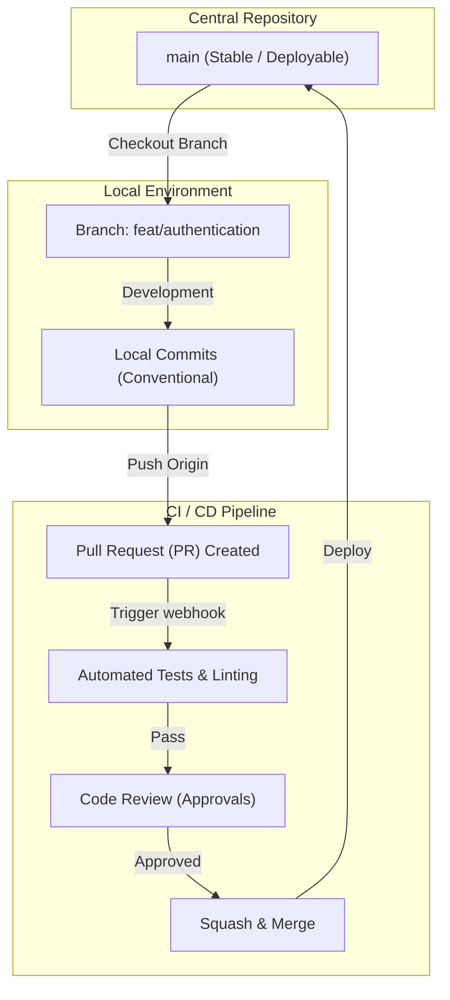

# Advanced Git Workflows & Rules

## Core Methodologies

This skill defines the authoritative conventions for source code versioning, focusing on robust collaboration and automated CI/CD triggers.

### 1. Trunk-Based Development vs GitFlow
- **Trunk-Based (Recommended):** All developers merge to `main` frequently (multiple times a day). Relies heavily on Feature Toggles (Dark Launching) and robust automated testing. Short-lived feature branches.
- **GitFlow (Legacy/Enterprise):** Separate branches for `develop`, `release`, `hotfix`, and `feature`. Useful for scheduled release cycles (e.g., mobile apps) but introduces "merge hell" if branches live too long.

### 2. Conventional Commits Standard
Every commit MUST follow the `<type>(<scope>): <subject>` format to enable automated semantic versioning and changelog generation.
- `feat:` A new feature (correlates with MINOR in SemVer).
- `fix:` A bug fix (correlates with PATCH in SemVer).
- `BREAKING CHANGE:` (correlates with MAJOR in SemVer).
- `chore:`, `docs:`, `style:`, `refactor:`, `perf:`, `test:`

### Branching Architecture Map

