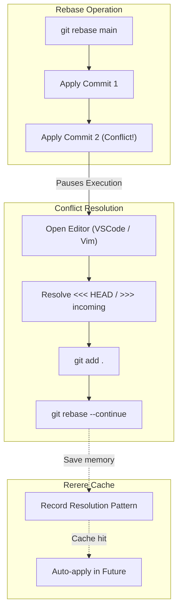

# Git Conflict Resolution & Triage

## Advanced Recovery Techniques

Handling Git conflicts is a crucial skill. This guide covers how to survive "Merge Hell" and use advanced Git features for history manipulation and debugging.

### 1. The 3-Way Merge Mechanism
When rebasing or merging, Git compares the current branch, the incoming branch, and their common ancestor (the merge base).
- **Merge Conflict:** Occurs when two branches modify the same line of the same file, or one deletes a file while the other modifies it.
- **Resolution:** Use `<<< HEAD` (current changes) and `>>> incoming` (incoming changes) markers to manually accept or combine lines.

### 2. Advanced: Git Rerere
**Reuse Recorded Resolution (Rerere)** is a hidden Git feature.
- **Concept:** When you resolve a conflict, Git remembers how you solved it. If the exact same conflict happens again (e.g., during a long rebase), Git resolves it automatically.
- **Enable:** `git config --global rerere.enabled true`

### 3. Advanced: Interactive Rebase & Bisect
- **`git rebase -i` (Interactive):** Allows you to squash, drop, edit, or reword previous commits. Crucial for cleaning up a messy feature branch before a PR.
- **`git bisect`:** Uses a binary search algorithm to find the exact commit that introduced a bug. You mark the current state as `bad` and a past state as `good`, and Git checks out commits in between for testing.

### Rebase & Conflict Flow

