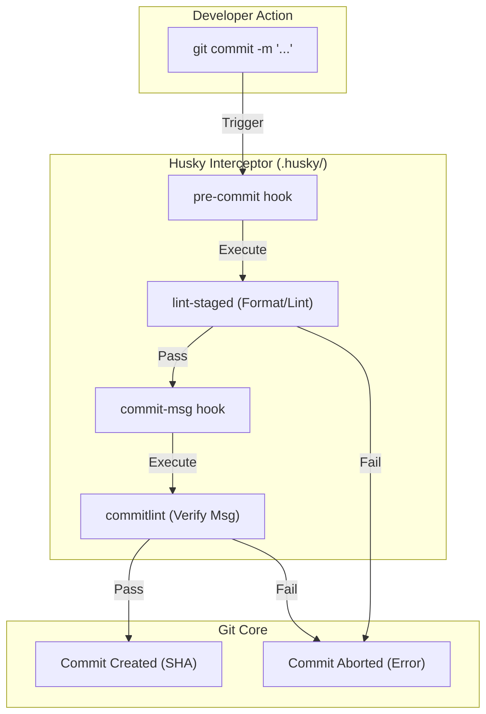

# Git Hooks & Automation (Husky)

## Core Mechanics

Git Hooks are scripts that run automatically every time a particular event occurs in a Git repository (e.g., commit, push). Husky provides a modern approach to managing these hooks via the `.husky/` directory.

### 1. Pre-Commit Hook (`lint-staged`)
Prevents dirty code from entering the repository.
- **Trigger:** Runs immediately upon executing `git commit`.
- **Action:** Triggers `lint-staged` which isolates only the files currently in the Git staging area (`git add`), running formatters (Prettier) and linters (ESLint/Ruff) exclusively on those files.

### 2. Commit-Msg Hook (`commitlint`)
Enforces the Conventional Commits specification.
- **Trigger:** Runs after entering the commit message but before the commit is finalized.
- **Action:** Triggers `@commitlint/cli` to parse the message. If it doesn't match `type(scope): subject`, the commit is aborted.

### 3. Pre-Push Hook (Test Suite)
- **Trigger:** Runs upon executing `git push`.
- **Action:** Executes the full unit test suite or heavy integration tests to ensure the branch doesn't break the remote pipeline.

### Hook Lifecycle Map

