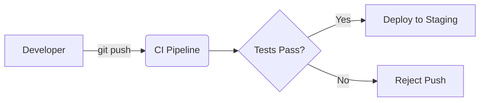

# Deployment Pipelines

## 1. Advanced Strategy and Execution

To optimize **Deployment Pipelines**, we enforce the following foundational rules:

- **AST Parsing**: Utilizing Abstract Syntax Trees to semantically analyze code structure.
- **Pre-commit Hooks**: Enforcing formatting and linting thresholds prior to Git staging.
- **HMR (Hot Module Replacement)**: Injecting updated modules without full page reloads via WebSockets.
- **VCS Bisecting**: Automating regression detection through binary search of commit history.

### Core Implementation
```javascript
// ESLint Custom Rule
module.exports = {
  create(context) {
    return {
      Identifier(node) {
        if (node.name === 'foo') context.report(node, 'Do not use foo');
      }
    };
  }
};
```

---

## 2. Advanced Strategy and Execution

To optimize **Deployment Pipelines**, we enforce the following foundational rules:

- **VCS Bisecting**: Automating regression detection through binary search of commit history.
- **AST Parsing**: Utilizing Abstract Syntax Trees to semantically analyze code structure.
- **HMR (Hot Module Replacement)**: Injecting updated modules without full page reloads via WebSockets.
- **CI/CD Pipelines**: Automating testing and deployment using GitHub Actions or GitLab CI.
- **Pre-commit Hooks**: Enforcing formatting and linting thresholds prior to Git staging.

### Mathematical Thresholds
$$ O(\log N) \text{ time complexity for Git bisect across } N \text{ commits} $$

---

## 3. Advanced Strategy and Execution

To optimize **Deployment Pipelines**, we enforce the following foundational rules:

- **VCS Bisecting**: Automating regression detection through binary search of commit history.
- **Pre-commit Hooks**: Enforcing formatting and linting thresholds prior to Git staging.
- **AST Parsing**: Utilizing Abstract Syntax Trees to semantically analyze code structure.
- **CI/CD Pipelines**: Automating testing and deployment using GitHub Actions or GitLab CI.
- **HMR (Hot Module Replacement)**: Injecting updated modules without full page reloads via WebSockets.

### System Architecture


---

## 4. Advanced Strategy and Execution

To optimize **Deployment Pipelines**, we enforce the following foundational rules:

- **Pre-commit Hooks**: Enforcing formatting and linting thresholds prior to Git staging.
- **CI/CD Pipelines**: Automating testing and deployment using GitHub Actions or GitLab CI.
- **HMR (Hot Module Replacement)**: Injecting updated modules without full page reloads via WebSockets.

### Mathematical Thresholds
$$ O(\log N) \text{ time complexity for Git bisect across } N \text{ commits} $$

---

## 5. Advanced Strategy and Execution

To optimize **Deployment Pipelines**, we enforce the following foundational rules:

- **Pre-commit Hooks**: Enforcing formatting and linting thresholds prior to Git staging.
- **AST Parsing**: Utilizing Abstract Syntax Trees to semantically analyze code structure.
- **VCS Bisecting**: Automating regression detection through binary search of commit history.
- **CI/CD Pipelines**: Automating testing and deployment using GitHub Actions or GitLab CI.
- **HMR (Hot Module Replacement)**: Injecting updated modules without full page reloads via WebSockets.

### Core Implementation
```javascript
// ESLint Custom Rule
module.exports = {
  create(context) {
    return {
      Identifier(node) {
        if (node.name === 'foo') context.report(node, 'Do not use foo');
      }
    };
  }
};
```

---

## 6. Advanced Strategy and Execution

To optimize **Deployment Pipelines**, we enforce the following foundational rules:

- **HMR (Hot Module Replacement)**: Injecting updated modules without full page reloads via WebSockets.
- **CI/CD Pipelines**: Automating testing and deployment using GitHub Actions or GitLab CI.
- **AST Parsing**: Utilizing Abstract Syntax Trees to semantically analyze code structure.
- **VCS Bisecting**: Automating regression detection through binary search of commit history.
- **Pre-commit Hooks**: Enforcing formatting and linting thresholds prior to Git staging.

### System Architecture


---

## 7. Advanced Strategy and Execution

To optimize **Deployment Pipelines**, we enforce the following foundational rules:

- **VCS Bisecting**: Automating regression detection through binary search of commit history.
- **HMR (Hot Module Replacement)**: Injecting updated modules without full page reloads via WebSockets.
- **AST Parsing**: Utilizing Abstract Syntax Trees to semantically analyze code structure.
- **Pre-commit Hooks**: Enforcing formatting and linting thresholds prior to Git staging.

### Core Implementation
```javascript
// ESLint Custom Rule
module.exports = {
  create(context) {
    return {
      Identifier(node) {
        if (node.name === 'foo') context.report(node, 'Do not use foo');
      }
    };
  }
};
```

---

## 8. Advanced Strategy and Execution

To optimize **Deployment Pipelines**, we enforce the following foundational rules:

- **HMR (Hot Module Replacement)**: Injecting updated modules without full page reloads via WebSockets.
- **VCS Bisecting**: Automating regression detection through binary search of commit history.
- **Pre-commit Hooks**: Enforcing formatting and linting thresholds prior to Git staging.

### Mathematical Thresholds
$$ O(\log N) \text{ time complexity for Git bisect across } N \text{ commits} $$

---

## 9. Advanced Strategy and Execution

To optimize **Deployment Pipelines**, we enforce the following foundational rules:

- **CI/CD Pipelines**: Automating testing and deployment using GitHub Actions or GitLab CI.
- **Pre-commit Hooks**: Enforcing formatting and linting thresholds prior to Git staging.
- **AST Parsing**: Utilizing Abstract Syntax Trees to semantically analyze code structure.
- **VCS Bisecting**: Automating regression detection through binary search of commit history.
- **HMR (Hot Module Replacement)**: Injecting updated modules without full page reloads via WebSockets.

### System Architecture


---

## 10. Advanced Strategy and Execution

To optimize **Deployment Pipelines**, we enforce the following foundational rules:

- **VCS Bisecting**: Automating regression detection through binary search of commit history.
- **AST Parsing**: Utilizing Abstract Syntax Trees to semantically analyze code structure.
- **CI/CD Pipelines**: Automating testing and deployment using GitHub Actions or GitLab CI.

### Mathematical Thresholds
$$ O(\log N) \text{ time complexity for Git bisect across } N \text{ commits} $$

---

## 11. Advanced Strategy and Execution

To optimize **Deployment Pipelines**, we enforce the following foundational rules:

- **HMR (Hot Module Replacement)**: Injecting updated modules without full page reloads via WebSockets.
- **AST Parsing**: Utilizing Abstract Syntax Trees to semantically analyze code structure.
- **CI/CD Pipelines**: Automating testing and deployment using GitHub Actions or GitLab CI.
- **VCS Bisecting**: Automating regression detection through binary search of commit history.
- **Pre-commit Hooks**: Enforcing formatting and linting thresholds prior to Git staging.

### Core Implementation
```javascript
// ESLint Custom Rule
module.exports = {
  create(context) {
    return {
      Identifier(node) {
        if (node.name === 'foo') context.report(node, 'Do not use foo');
      }
    };
  }
};
```

---
