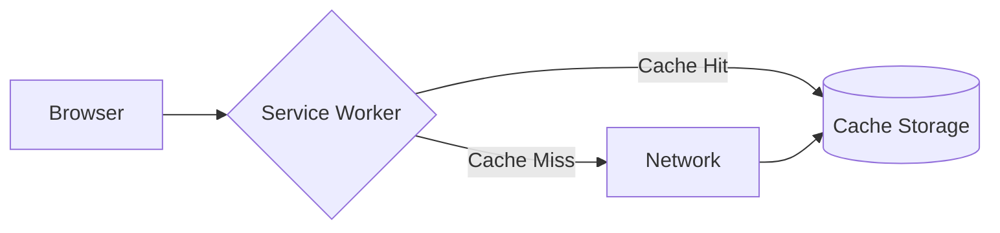

# Versioning Strategies

## 1. Advanced Strategy and Execution

To optimize **Versioning Strategies**, we enforce the following foundational rules:

- **Service Workers**: Intercepting network requests for offline caching and Progressive Web App (PWA) support.
- **WebSockets & SSE**: Utilizing Server-Sent Events for one-way realtime streams.
- **IndexedDB**: Asynchronous client-side storage for massive structured datasets.
- **Web Accessibility (a11y)**: Ensuring ARIA labels and keyboard navigation support for screen readers.
- **WebAssembly (Wasm)**: Executing C/Rust binaries in the browser at near-native speeds.

### Core Implementation
```javascript
navigator.serviceWorker.register('/sw.js').then(reg => {
  console.log('SW registered!', reg);
}).catch(err => console.log('Boo!', err));
```

---

## 2. Advanced Strategy and Execution

To optimize **Versioning Strategies**, we enforce the following foundational rules:

- **WebAssembly (Wasm)**: Executing C/Rust binaries in the browser at near-native speeds.
- **Service Workers**: Intercepting network requests for offline caching and Progressive Web App (PWA) support.
- **WebSockets & SSE**: Utilizing Server-Sent Events for one-way realtime streams.
- **IndexedDB**: Asynchronous client-side storage for massive structured datasets.

### Mathematical Thresholds
$$ \text{Lighthouse Score} = \alpha \times \text{LCP} + \beta \times \text{FID} + \gamma \times \text{CLS} $$

---

## 3. Advanced Strategy and Execution

To optimize **Versioning Strategies**, we enforce the following foundational rules:

- **WebAssembly (Wasm)**: Executing C/Rust binaries in the browser at near-native speeds.
- **Service Workers**: Intercepting network requests for offline caching and Progressive Web App (PWA) support.
- **Web Accessibility (a11y)**: Ensuring ARIA labels and keyboard navigation support for screen readers.

### System Architecture


---

## 4. Advanced Strategy and Execution

To optimize **Versioning Strategies**, we enforce the following foundational rules:

- **IndexedDB**: Asynchronous client-side storage for massive structured datasets.
- **WebSockets & SSE**: Utilizing Server-Sent Events for one-way realtime streams.
- **Service Workers**: Intercepting network requests for offline caching and Progressive Web App (PWA) support.
- **WebAssembly (Wasm)**: Executing C/Rust binaries in the browser at near-native speeds.
- **Web Accessibility (a11y)**: Ensuring ARIA labels and keyboard navigation support for screen readers.

### Mathematical Thresholds
$$ \text{Lighthouse Score} = \alpha \times \text{LCP} + \beta \times \text{FID} + \gamma \times \text{CLS} $$

---

## 5. Advanced Strategy and Execution

To optimize **Versioning Strategies**, we enforce the following foundational rules:

- **WebAssembly (Wasm)**: Executing C/Rust binaries in the browser at near-native speeds.
- **IndexedDB**: Asynchronous client-side storage for massive structured datasets.
- **Web Accessibility (a11y)**: Ensuring ARIA labels and keyboard navigation support for screen readers.
- **WebSockets & SSE**: Utilizing Server-Sent Events for one-way realtime streams.
- **Service Workers**: Intercepting network requests for offline caching and Progressive Web App (PWA) support.

### Core Implementation
```javascript
navigator.serviceWorker.register('/sw.js').then(reg => {
  console.log('SW registered!', reg);
}).catch(err => console.log('Boo!', err));
```

---

## 6. Advanced Strategy and Execution

To optimize **Versioning Strategies**, we enforce the following foundational rules:

- **WebAssembly (Wasm)**: Executing C/Rust binaries in the browser at near-native speeds.
- **WebSockets & SSE**: Utilizing Server-Sent Events for one-way realtime streams.
- **Service Workers**: Intercepting network requests for offline caching and Progressive Web App (PWA) support.

### System Architecture


---

## 7. Advanced Strategy and Execution

To optimize **Versioning Strategies**, we enforce the following foundational rules:

- **Service Workers**: Intercepting network requests for offline caching and Progressive Web App (PWA) support.
- **IndexedDB**: Asynchronous client-side storage for massive structured datasets.
- **Web Accessibility (a11y)**: Ensuring ARIA labels and keyboard navigation support for screen readers.
- **WebAssembly (Wasm)**: Executing C/Rust binaries in the browser at near-native speeds.

### Core Implementation
```javascript
navigator.serviceWorker.register('/sw.js').then(reg => {
  console.log('SW registered!', reg);
}).catch(err => console.log('Boo!', err));
```

---

## 8. Advanced Strategy and Execution

To optimize **Versioning Strategies**, we enforce the following foundational rules:

- **Web Accessibility (a11y)**: Ensuring ARIA labels and keyboard navigation support for screen readers.
- **WebAssembly (Wasm)**: Executing C/Rust binaries in the browser at near-native speeds.
- **Service Workers**: Intercepting network requests for offline caching and Progressive Web App (PWA) support.

### Mathematical Thresholds
$$ \text{Lighthouse Score} = \alpha \times \text{LCP} + \beta \times \text{FID} + \gamma \times \text{CLS} $$

---

## 9. Advanced Strategy and Execution

To optimize **Versioning Strategies**, we enforce the following foundational rules:

- **Service Workers**: Intercepting network requests for offline caching and Progressive Web App (PWA) support.
- **IndexedDB**: Asynchronous client-side storage for massive structured datasets.
- **WebSockets & SSE**: Utilizing Server-Sent Events for one-way realtime streams.

### System Architecture


---

## 10. Advanced Strategy and Execution

To optimize **Versioning Strategies**, we enforce the following foundational rules:

- **Web Accessibility (a11y)**: Ensuring ARIA labels and keyboard navigation support for screen readers.
- **IndexedDB**: Asynchronous client-side storage for massive structured datasets.
- **WebAssembly (Wasm)**: Executing C/Rust binaries in the browser at near-native speeds.
- **WebSockets & SSE**: Utilizing Server-Sent Events for one-way realtime streams.
- **Service Workers**: Intercepting network requests for offline caching and Progressive Web App (PWA) support.

### Mathematical Thresholds
$$ \text{Lighthouse Score} = \alpha \times \text{LCP} + \beta \times \text{FID} + \gamma \times \text{CLS} $$

---

## 11. Advanced Strategy and Execution

To optimize **Versioning Strategies**, we enforce the following foundational rules:

- **WebAssembly (Wasm)**: Executing C/Rust binaries in the browser at near-native speeds.
- **Web Accessibility (a11y)**: Ensuring ARIA labels and keyboard navigation support for screen readers.
- **WebSockets & SSE**: Utilizing Server-Sent Events for one-way realtime streams.
- **IndexedDB**: Asynchronous client-side storage for massive structured datasets.
- **Service Workers**: Intercepting network requests for offline caching and Progressive Web App (PWA) support.

### Core Implementation
```javascript
navigator.serviceWorker.register('/sw.js').then(reg => {
  console.log('SW registered!', reg);
}).catch(err => console.log('Boo!', err));
```

---
