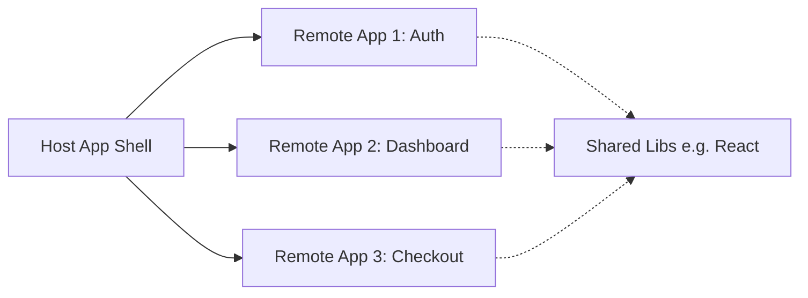

# Micro-Frontends

## Core Concepts
- **Module Federation:** Dynamically load code from another Webpack/Vite build at runtime.
- **Host App (Shell):** The main container application.
- **Remote App:** Independently deployed feature modules.

## Mermaid Diagram


## Best Practices & Code Snippets

### 1. Webpack Module Federation Config (Host)
```javascript
// webpack.config.js (Host)
const ModuleFederationPlugin = require('webpack/lib/container/ModuleFederationPlugin');

module.exports = {
  plugins: [
    new ModuleFederationPlugin({
      name: 'host',
      remotes: {
        app1: 'app1@http://localhost:3001/remoteEntry.js',
      },
      shared: { react: { singleton: true }, 'react-dom': { singleton: true } },
    }),
  ],
};
```

### 2. Consuming Remote Components
```tsx
import React, { Suspense } from 'react';

// Dynamically import the remote component
const RemoteButton = React.lazy(() => import('app1/Button'));

export default function App() {
  return (
    <div>
      <h1>Host Application</h1>
      <Suspense fallback={<div>Loading Remote Button...</div>}>
        <RemoteButton />
      </Suspense>
    </div>
  );
}
```
