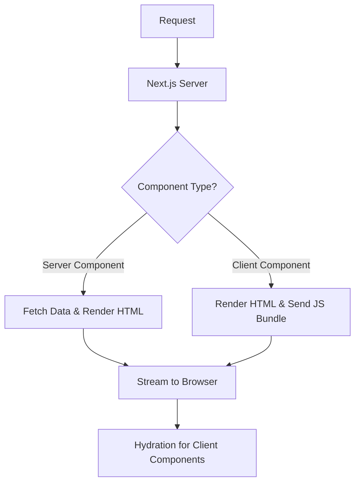

# Next.js Server Components

## Core Concepts
- **Server Components (RSC):** Render exclusively on the server. Zero bundle size impact.
- **Client Components:** Render on both client and server. Use only for interactivity.
- **Streaming:** Progressively render UI to the client, reducing Time To First Byte (TTFB).

## Mermaid Diagram


## Best Practices & Code Snippets

### 1. Data Fetching in Server Components
Fetch data directly in components to leverage caching and avoid client-side waterfalls.

```tsx
// app/page.tsx (Server Component)
async function getData() {
  const res = await fetch('https://api.example.com/data', { next: { revalidate: 3600 } });
  return res.json();
}

export default async function Page() {
  const data = await getData();
  return <main>{data.title}</main>;
}
```

### 2. Streaming with Suspense
Wrap slow data-fetching components in `<Suspense>` to unblock the rest of the UI.

```tsx
import { Suspense } from 'react';
import SlowComponent from './SlowComponent';

export default function Layout() {
  return (
    <section>
      <h1>Dashboard</h1>
      <Suspense fallback={<p>Loading data...</p>}>
        <SlowComponent />
      </Suspense>
    </section>
  );
}
```
