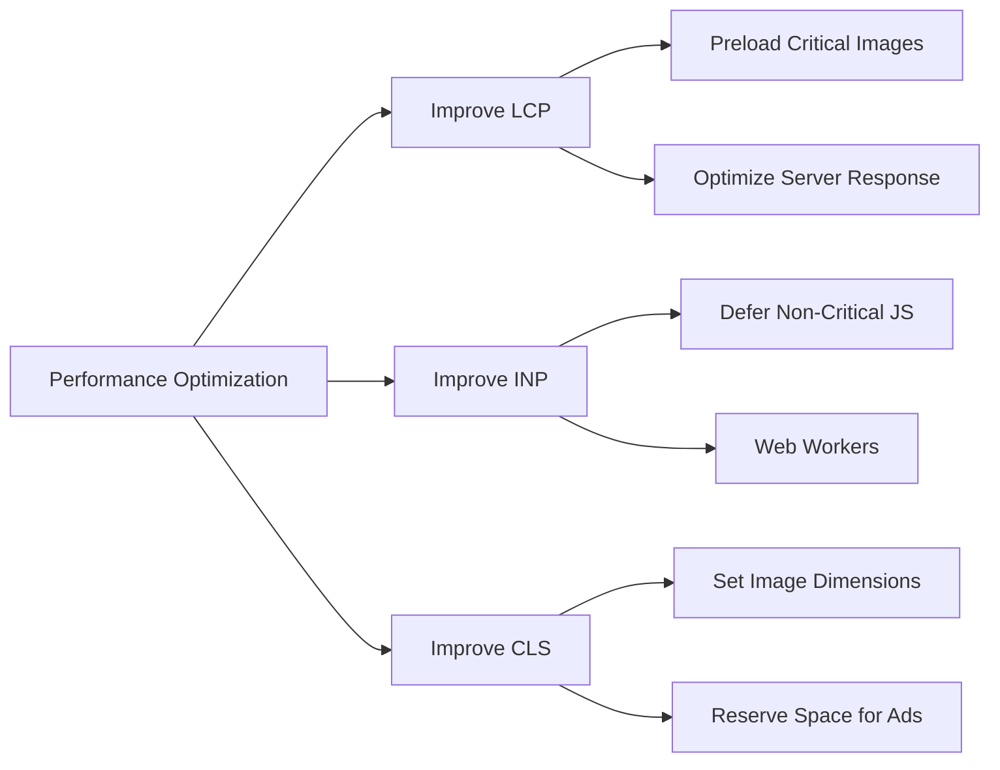

# Web Performance

## Core Web Vitals
- **LCP (Largest Contentful Paint):** Measures loading performance (target < 2.5s).
- **INP (Interaction to Next Paint) / FID:** Measures interactivity and responsiveness (target < 200ms).
- **CLS (Cumulative Layout Shift):** Measures visual stability (target < 0.1).

## Mermaid Diagram


## Best Practices & Code Snippets

### 1. Optimizing LCP (Preloading)
```html
<!-- Preload the hero image to improve LCP -->
<link rel="preload" as="image" href="/hero-image.webp" />
```

### 2. Optimizing CLS (Image Dimensions)
Always specify `width` and `height` to prevent layout shifts when images load.
```css
/* CSS fallback for responsive images */
img {
  max-width: 100%;
  height: auto;
}
```
```html

```

### 3. Optimizing INP (Yielding to Main Thread)
```javascript
// Break up long tasks using setTimeout or scheduler.yield
function processLargeArray(items) {
  let i = 0;
  function chunk() {
    const end = Math.min(i + 50, items.length);
    while (i < end) {
      process(items[i++]);
    }
    if (i < items.length) setTimeout(chunk, 0); // Yield to main thread
  }
  chunk();
}
```
