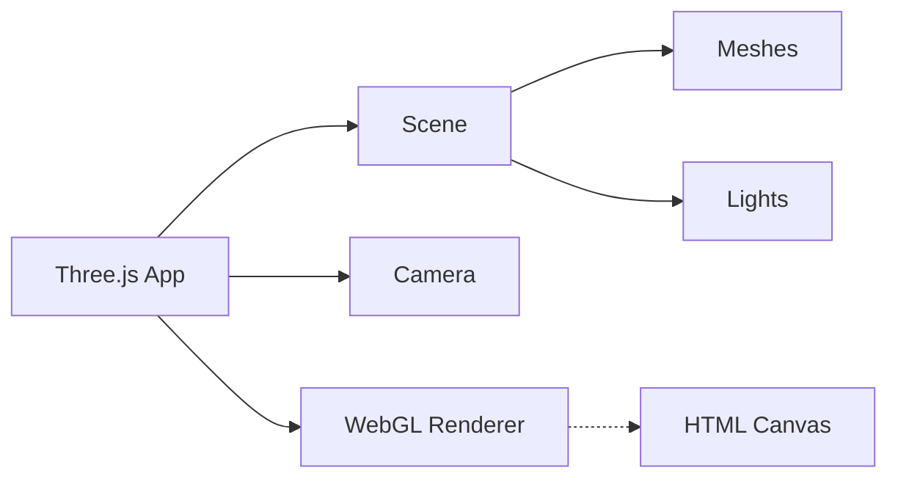

# Web3D & WebGL

## Core Concepts
- **Scene Graph:** Hierarchical tree of 3D objects, lights, and cameras.
- **Renderer:** The engine that draws the scene onto a HTML `<canvas>`.
- **Optimization:** Frustum culling, instance rendering, and geometry simplification.

## Mermaid Diagram


## Best Practices & Code Snippets

### 1. Basic Three.js Setup
```javascript
import * as THREE from 'three';

// Setup
const scene = new THREE.Scene();
const camera = new THREE.PerspectiveCamera(75, window.innerWidth / window.innerHeight, 0.1, 1000);
const renderer = new THREE.WebGLRenderer({ antialias: true, alpha: true });
renderer.setSize(window.innerWidth, window.innerHeight);
document.body.appendChild(renderer.domElement);

// Object
const geometry = new THREE.BoxGeometry();
const material = new THREE.MeshStandardMaterial({ color: 0x00ff00 });
const cube = new THREE.Mesh(geometry, material);
scene.add(cube);

// Lighting
const light = new THREE.PointLight(0xffffff, 1, 100);
light.position.set(10, 10, 10);
scene.add(light);

camera.position.z = 5;

// Animation Loop
function animate() {
  requestAnimationFrame(animate);
  cube.rotation.x += 0.01;
  cube.rotation.y += 0.01;
  renderer.render(scene, camera);
}
animate();
```

### 2. React Three Fiber Integration (R3F)
```tsx
import { Canvas } from '@react-three/fiber';

function Box() {
  return (
    <mesh rotation={[0.5, 0.5, 0]}>
      <boxGeometry attach="geometry" args={[1, 1, 1]} />
      <meshStandardMaterial attach="material" color="hotpink" />
    </mesh>
  );
}

export default function App() {
  return (
    <div style={{ height: '100vh' }}>
      <Canvas>
        <ambientLight intensity={0.5} />
        <pointLight position={[10, 10, 10]} />
        <Box />
      </Canvas>
    </div>
  );
}
```
